

  

# Universidad Peruana de Ciencias Aplicadas

## Carrera de Ingeniería de Software

Ciclo: 2024 - 0 2

Curso: Desarrollo de Aplicaciones Web

Sección: SI92

Profesor: Naldo Reupo-Musayon Gastulo

“Informe de Trabajo Final”

Startup: TechTitans

Producto: FinanceGuard

|          Integrantes           |   Código   |
| :----------------------------: | :--------: |
|      Ramos Carpio, Karen       | U20201E493 |
|      Martinez Villanueva, Piero Alonso       | U202113821 |

Agosto 2024

 
 
 
 
 
 
 
 
 

# **Registro de Versiones**

<table>
  <thead>
    <tr>
        <th>Versión</th>
        <th>Fecha</th>
        <th>Autor</th>
        <th>Descripción de modificación</th>
    </tr>
  </thead>
  <tbody>
  <tr>
      <td><strong>TB1</strong></td>
      <td></td>
      <td>
        <ul>
          <li>Ramos Carpio, Karen</li>
        </ul>
      </td>
      <td>
        Se han incluído los siguientes capítulos:
        <ul>
          <li>Capítulo I: Introducción</li>
          <li>Capítulo II: Requirements Elicitation & Analysis</li>
          <li>Capítulo III: Requirements Specification</li>
          <li>Capítulo IV: Product Design</li>
          <li>Avance del Capítulo V: Product Implementation, Validation & Deployment hasta el punto 5.2.1.8</li>
          <li>Avance de Conclusiones, Bibliografía y Anexos</li>
        </ul>
      </td>
  </tr>
  </tbody>
</table>

 
 
 
 
 
 
 
 
 
 
 
 
 

# **Student Outcomes**

<table style="border-collapse: collapse; width: 100%; border: 1px solid black;">
  <thead>
    <tr style="border-bottom: 1px solid black;">
      <th style="border-right: 1px solid black;">Criterio Específico</th>
      <th style="border-right: 1px solid black;">Acciones Realizadas</th>
      <th>Conclusiones</th>
    </tr>
  </tbody>
</table>

# **Project Report Online**

URL Project Report (Github): 

### [Capítulo I: Introducción]()
- [1.1. Startup Profile]()
    - [1.1.1 Descripción de la Startup]()
    - [1.1.2 Perfiles de integrantes del equipo]()
- [1.2 Solution Profile]()
    - [1.2.1 Antecedentes y problemática]()
    - [1.2.2 Lean UX Process]()
        - [1.2.2.1. Lean UX Problem Statements]()
        - [1.2.2.2. Lean UX Assumptions]()
        - [1.2.2.3. Lean UX Hypothesis Statements]()
        - [1.2.2.4. Lean UX Canvas]()
- [1.3. Segmentos objetivo]()

### [Capítulo II: Requirements Elicitation & Analysis]()
- [2.1. Competidores]()
    - [2.1.1. Análisis competitivo]()
    - [2.1.2. Estrategias y tácticas frente a competidores]()
- [2.2. Entrevistas]()
    - [2.2.1. Diseño de entrevistas]()
    - [2.2.2. Registro de entrevistas]()
    - [2.2.3. Análisis de entrevistas]()
- [2.3. Needfinding]()
    - [2.3.1. User Personas]()
    - [2.3.2. User Task Matrix]()
    - [2.3.3. User Journey Mapping]()
    - [2.3.4. Empathy Mapping]()
    - [2.3.5. As-is Scenario Mapping]()
- [2.4. Ubiquitous Language]()

### [Capítulo III: Requirements Specification]()
- [3.1. To-Be Scenario Mapping]()
- [3.2. User Stories]()
- [3.3. Impact Mapping]()
- [3.4. Product Backlog]()

### [Capítulo IV: Product Design]()
- [4.1. Style Guidelines]()
    - [4.1.1. General Style Guidelines]()
    - [4.1.2. Web Style Guidelines]()
- [4.2. Information Architecture]()
    - [4.2.1. Organization Systems]()
    - [4.2.2. Labeling Systems]()
    - [4.2.3. SEO Tags and Meta Tags]()
    - [4.2.4. Searching Systems]()
    - [4.2.5. Navigation Systems]()
- [4.3. Landing Page UI Design]()
    - [4.3.1. Landing Page Wireframe]()
    - [4.3.2. Landing Page Mock-up]()
- [4.4. Web Applications UX/UI Design]()
    - [4.4.1. Web Applications Wireframes]()
    - [4.4.2. Web Applications Wireflow Diagrams]()
    - [4.4.3. Web Applications Mock-ups]()
    - [4.4.4. Web Applications User Flow Diagrams]()
- [4.5. Web Applications Prototyping]()
- [4.6. Domain-Driven Software Architecture]()
    - [4.6.1. Software Architecture Context Diagram]()
    - [4.6.2. Software Architecture Container Diagrams]()
    - [4.6.3. Software Architecture Components Diagrams]()
- [4.7. Software Object-Oriented Design]()
    - [4.7.1. Class Diagrams]()
    - [4.7.2. Class Dictionary]()
- [4.8. Database Design]()
    - [4.8.1. Database Diagram]()

### [Capítulo V: Product Implementation, Validation & Deployment]()
- [5.1. Software Configuration Management]()
    - [5.1.1. Software Development Environment Configuration]()
    - [5.1.2. Source Code Management]()
    - [5.1.3. Source Code Style Guide & Conventions]()
    - [5.1.4. Software Deployment Configuration]()
- [5.2. Landing Page, Services & Applications Implementation]()
    - [5.2.1. Sprint 1]()
        - [5.2.1.1. Sprint Planning 1]()
        - [5.2.1.2. Sprint Backlog 1]()
        - [5.2.1.3. Development Evidence for Sprint Review]()
        - [5.2.1.4. Testing Suite Evidence for Sprint Review]()
        - [5.2.1.5. Execution Evidence for Sprint Review]()
        - [5.2.1.6. Services Documentation Evidence for Sprint Review]()
        - [5.2.1.7. Software Deployment Evidence for Sprint Review]()
        - [5.2.1.8. Team Collaboration Insights during Sprint]()
    - [5.2.2. Sprint 2]()
        - [5.2.2.1. Sprint Planning 2]()
        - [5.2.2.2. Sprint Backlog 2]()
        - [5.2.2.3. Development Evidence for Sprint Review]()
        - [5.2.2.4. Testing Suite Evidence for Sprint Review]()
        - [5.2.2.5. Execution Evidence for Sprint Review]()
        - [5.2.2.6. Services Documentation Evidence for Sprint Review]()
        - [5.2.2.7. Software Deployment Evidence for Sprint Review]()
        - [5.2.2.8. Team Collaboration Insights during Sprint]()
    - [5.2.3. Sprint 3]()
        - [5.2.3.1. Sprint Planning 3]()
        - [5.2.3.2. Sprint Backlog 3]()
        - [5.2.3.3. Development Evidence for Sprint Review]()
        - [5.2.3.4. Testing Suite Evidence for Sprint Review]()
        - [5.2.3.5. Execution Evidence for Sprint Review]()
        - [5.2.3.6. Services Documentation Evidence for Sprint Review]()
        - [5.2.3.7. Software Deployment Evidence for Sprint Review]()
        - [5.2.3.8. Team Collaboration Insights during Sprint]()
    - [5.2.4. Sprint 4]()
        - [5.2.4.1. Sprint Planning 4]()
        - [5.2.4.2. Sprint Backlog 4]()
        - [5.2.4.3. Development Evidence for Sprint Review]()
        - [5.2.4.4. Testing Suite Evidence for Sprint Review]()
        - [5.2.4.5. Execution Evidence for Sprint Review]()
        - [5.2.4.6. Services Documentation Evidence for Sprint Review]()
        - [5.2.4.7. Software Deployment Evidence for Sprint Review]()
        - [5.2.4.8. Team Collaboration Insights during Sprint]()
- [5.3. Validation Interviews]()
    - [5.3.1. Diseño de Entrevistas]()
    - [5.3.2. Registro de Entrevistas]()
    - [5.3.3. Evaluaciones según heurísticas]()
- [5.4. Video About-the-Product]()

---
# Capítulo I: Introducción
## 1.1. Startup Profile

Esta sección proporciona una visión integral de la startup, incluyendo una descripción detallada de su misión, visión, y el producto que ofrece. Además, se presentan los perfiles de los miembros clave del equipo, destacando sus habilidades, experiencia y contribuciones al desarrollo y éxito de la empresa. Aquí se busca brindar una comprensión completa de la identidad y el potencial del startup, así como de las personas que impulsan su crecimiento.

### 1.1.1 Descripción de la Startup

*TechTitans* presenta *FinanceGuard*, una innovadora plataforma diseñada para gestionar tanto las finanzas personales como empresariales. Con el objetivo principal de simplificar la administración del dinero y mejorar la organización financiera de sus usuarios, FinanceGuard ofrece una experiencia intuitiva y eficiente.

La plataforma permite a los usuarios crear grupos para gestionar y compartir gastos de manera colaborativa. Dentro de estos grupos, se pueden registrar gastos, especificar quién pagó y cuánto, así como distribuir los costos entre los participantes. Además, FinanceGuard calcula automáticamente las deudas y saldos, proporcionando una visión clara de quién debe a quién, lo que resulta especialmente útil para compañeros de cuarto, parejas, amigos o familiares que comparten gastos en actividades como viajes, cenas, alquileres, facturas de servicios y compras conjuntas.

Más allá de las finanzas personales, FinanceGuard ofrece herramientas avanzadas para la gestión financiera empresarial. Entre estas, se incluyen la conciliación de cuentas y la generación de reportes contables detallados, facilitando el seguimiento y optimización de los recursos económicos de las empresas.

FinanceGuard empodera a sus usuarios, tanto individuales como corporativos, a tomar el control de su bienestar financiero, brindándoles las herramientas necesarias para seguir sus gastos, establecer metas financieras y ajustar sus presupuestos en función de sus objetivos económicos. Esta solución integral no solo mejora la transparencia financiera, sino que también promueve una mayor estabilidad económica, ayudando a los usuarios a alcanzar sus metas con confianza.

**Misión:** En FinanceGuard, nuestra misión es capacitar a individuos y empresas para que tomen las riendas de su bienestar financiero mediante una administración precisa, accesible y fácil de usar. Nos comprometemos a ofrecer soluciones innovadoras que simplifiquen el monitoreo, la planificación y la optimización de los recursos financieros, con el propósito de fomentar una mayor seguridad económica y ayudar a nuestros usuarios a cumplir sus objetivos financieros con certeza.

**Visión:** Aspiramos a convertirnos en la plataforma de referencia en la gestión financiera personal y empresarial, reconocida por nuestra capacidad de revolucionar la manera en que las personas y organizaciones administran sus finanzas. Nuestro objetivo es construir un futuro donde la claridad financiera y la educación económica estén al alcance de todos, contribuyendo al desarrollo económico y al bienestar integral de nuestros usuarios.

**Logotipo del servicio:**

### 1.1.2 Perfiles de integrantes del equipo

<TABLE BORDER>
	<TR>
		<TH><h2>Intregantes</h2></TH> 
		<TH><h2>Descripción</h2></TH>
		<TH><h2>Conocimientos</h2></TH>
	</TR>
	<TR>
		<td style="text-align: center" align="center">
 Karen Ramos Carpio - U20201E493  
</td>
		<td style="text-align: center" align="center">Cuento con gran capacidad de autoaprendizaje, esto me permite alcanzar mejores índices de productividad para la empresa de forma individual como en trabajo en equipo para poder llegar a los 		objetivos definidos por la empresa.Tengo un alto sentido del compromiso y la responsabilidad por lo que puedo garantizar que la tarea que me sea asignada será gestionada con diligencia.</td>
		<td style="text-align: center" align="center">Desarrollador entusiasta de resolución de problemas de .NET con experiencia en C#, JavaScript, TypeScript, Golang, C++, HTML CSS. Además de .NET, .Net Core, Angular, React y Kendo UI. 			Trabaja bien tanto individualmente como en un ambiente de equipo. Como profesional de TI, me dedico a administrar mis proyectos hasta su finalización, asegurándose de que se completen en el plazo establecido</td>
	</TR>
  	<TR>
		<td style="text-align: center" align="center">
 Piero Alonso Martinez Villanueva - U202113821  
</td> 
		<td style="text-align: center" align="center">Poseo experiencia en trabajo en equipo, aportando ideas innovadoras y soluciones eficaces, siendo puntual con los plazos establecidos en la elaboración de los proyectos. Me gusta aprender sobre nuevas tecnologías, además de ser paciente y perseverante en el desarrrollo de un proyecto.</td>
		<td style="text-align: center" align="center">Tengo experiencia en lenguajes de programación como C++, C#, Java, JavaScript y HTML y en programas de diseño como Illustrator, Photoshop, CorelDraw y Maya3D.</td>
	</TR>
  <TR>
		<td style="text-align: center" align="center">
 xxxxxxx - U   
</td> 
		<td style="text-align: center" align="center">xxx</td>
		<td style="text-align: center" align="center">xxx</td>
	</TR>
  <TR>
		<td style="text-align: center" align="center">
 xxxxxxx - U   
</td> 
		<td style="text-align: center" align="center">xxx</td>
		<td style="text-align: center" align="center">xxx</td>
	</TR>
  <TR>
		<td style="text-align: center" align="center">
 xxxxxxx - U   
</td> 
		<td style="text-align: center" align="center">xxx</td>
		<td style="text-align: center" align="center">xxx</td>
	</TR>
  <TR>
		<td style="text-align: center" align="center">
 xxxxxxx - U   
</td> 
		<td style="text-align: center" align="center">xxx</td>
		<td style="text-align: center" align="center">xxx</td>
	</TR>
</TABLE>

## 1.2 Solution Profile
### 1.2.1 Antecedentes y problemática
Para identificar el contexto en el que se situa FinanceGuard, utilizaremos la técnica de las 5 W's y 2 H's.

#### 1.2.1.1. Las 5 W's:

- **What (Qué):** 
FinanceGuard es una plataforma digital diseñada para simplificar la gestión de finanzas tanto personales como empresariales. Permite a los usuarios organizar y compartir gastos, gestionar deudas, y seguir objetivos financieros. Además, ofrece herramientas avanzadas para la conciliación de cuentas y la generación de reportes contables.

- **Why (Por qué):** 
Existe una necesidad creciente de herramientas que faciliten la gestión financiera, especialmente en contextos de colaboración como grupos de amigos, compañeros de cuarto, parejas, y empresas. FinanceGuard responde a esta necesidad ofreciendo una solución que promueve la transparencia, la organización y la estabilidad financiera.

- **Who (Quién):** 
El producto está dirigido a individuos que comparten gastos con otros, como amigos, compañeros de cuarto, parejas, y familiares, así como a pequeñas y medianas empresas que requieren herramientas eficientes para la gestión contable y financiera.

- **Where (Dónde):** 
FinanceGuard se implementa como una aplicación móvil y web, accesible desde cualquier lugar con conexión a internet, lo que permite a los usuarios gestionar sus finanzas en tiempo real, sin importar su ubicación.

- **When (Cuándo):** 
El uso de FinanceGuard es continuo, permitiendo a los usuarios realizar un seguimiento constante de sus finanzas, tanto en el día a día como a largo plazo, ajustándose a sus necesidades en cualquier momento.

#### 1.2.1.2. Las 2 H's:

- **How (Cómo):** 
FinanceGuard funciona mediante la creación de grupos donde los usuarios pueden agregar y gestionar gastos compartidos. La plataforma automatiza el cálculo de deudas y saldos, proporciona herramientas para establecer y seguir objetivos financieros, y ofrece funciones específicas para la gestión empresarial, como la conciliación de cuentas y la generación de reportes.

- **How much (Cuánto):** 
El modelo de negocio puede incluir diferentes niveles de suscripción, desde una versión gratuita con funciones básicas hasta planes de pago que ofrecen características avanzadas para usuarios personales y empresariales. El costo variará según el nivel de acceso y las herramientas necesarias para cada tipo de usuario.

### 1.2.2 Lean UX Process
#### 1.2.2.1. Lean UX Problem Statements
FinanceGuard es una plataforma integral diseñada para la gestión de finanzas personales y empresariales. Su objetivo es ofrecer a los usuarios una solución completa para el seguimiento de gastos, la organización de presupuestos, y la optimización de recursos económicos, tanto a nivel individual como para pequeñas y medianas empresas.

Hemos identificado que en el contexto actual, muchas personas y organizaciones enfrentan dificultades significativas debido a la falta de herramientas efectivas para la administración financiera. La dependencia de métodos manuales, como hojas de cálculo y registros dispersos, conlleva a problemas de desorganización, errores en el seguimiento de gastos, y una gestión ineficiente de los recursos económicos. Esto puede resultar en desequilibrios presupuestarios, pérdidas económicas, y dificultades para alcanzar metas financieras, afectando tanto la estabilidad financiera como la capacidad de toma de decisiones informadas.

¿Cómo podríamos abordar estos problemas mediante una herramienta que integre y automatice la gestión financiera, proporcionando una visión clara y accesible de los ingresos, gastos y deudas? La solución debería simplificar la planificación financiera, mejorar la precisión en el seguimiento de metas económicas y facilitar la toma de decisiones estratégicas, contribuyendo así a una mayor estabilidad y éxito financiero a largo plazo.

#### 1.2.2.2. Lean UX Assumptions

##### 1.2.2.2.1. Assumptions:

- Existe una demanda en el mercado para una solución digital que simplifique la gestión de finanzas personales y empresariales, ayudando a los usuarios a mantener un control más preciso sobre sus recursos económicos.
- Los individuos y las pequeñas y medianas empresas están dispuestos a adoptar una plataforma digital para la administración financiera, reconociendo sus beneficios en términos de claridad, eficiencia y toma de decisiones.
- La plataforma será técnicamente viable y escalable, capaz de manejar grandes volúmenes de datos financieros y operaciones complejas.
- Se espera que la plataforma proporcione a los usuarios una mejora significativa en la organización de sus finanzas, reduciendo el riesgo de errores y facilitando la planificación financiera.
- Se asume que una interfaz de usuario intuitiva y fácil de usar será clave para la aceptación y adopción generalizada de la plataforma.
- Se anticipa que la plataforma ofrecerá funcionalidades de integración con otras herramientas financieras y bancos para facilitar una gestión financiera más coherente y completa.

##### 1.2.2.2.2. Features:

- La plataforma permitirá el seguimiento en tiempo real de gastos e ingresos, facilitando una gestión financiera precisa y actualizada.
- Integrará funcionalidades para la creación y seguimiento de presupuestos y metas financieras, ayudando a los usuarios a planificar y ajustar sus finanzas de manera efectiva.
- Ofrecerá herramientas automáticas para el cálculo de deudas y saldos, proporcionando una visión clara de las obligaciones financieras entre los usuarios.
- Incorporará alertas automáticas y recordatorios para fechas límite de pagos y vencimientos de presupuestos, ayudando a evitar retrasos y cargos adicionales.
- Dispone de una interfaz intuitiva y fácil de usar que permite a los usuarios gestionar sus finanzas de manera sencilla y accesible.
- Ofrecerá capacidades de generación de reportes financieros detallados y personalizados, facilitando la toma de decisiones y la planificación estratégica.

#### 1.2.2.3. Lean UX Hypothesis Statements
- **1st Hypothesis Statement:**  
Nosotros creemos que si implementamos una función de categorización automática de gastos en FinanceGuard,
Cuando los usuarios registren nuevas transacciones en la plataforma,
Veremos que la clasificación y organización de los gastos mejorará, y los usuarios podrán generar reportes financieros más precisos y detallados sin esfuerzo adicional,
Mediremos esto a través de la comparación del tiempo invertido en categorizar gastos manualmente antes y después de la implementación, así como la retroalimentación de los usuarios sobre la precisión y utilidad de la categorización automática.

- **2nd Hypothesis Statement:**  
Nosotros creemos que si desarrollamos una función de alertas personalizadas para vencimientos de pagos y metas financieras en FinanceGuard,
Cuando los usuarios configuren sus alertas y realicen un seguimiento de sus pagos y objetivos en la plataforma,
Veremos que la puntualidad en los pagos y el cumplimiento de metas financieras mejorará, reduciendo la cantidad de cargos por pagos atrasados y ayudando a los usuarios a alcanzar sus metas con mayor eficacia,
Mediremos esto a través de la comparación de la cantidad de cargos por pagos atrasados y la tasa de cumplimiento de metas antes y después de la implementación de las alertas personalizadas, así como la retroalimentación de los usuarios sobre la efectividad y utilidad de las alertas.

- **3rd Hypothesis Statement:**  
Nosotros creemos que si integramos una herramienta de análisis de tendencias financieras en FinanceGuard que utilice datos históricos para predecir patrones de gastos e ingresos,
Cuando los usuarios consulten estos análisis para planificar su presupuesto y ajustar sus gastos,
Veremos que la precisión en la planificación financiera y la toma de decisiones mejorará, permitiendo a los usuarios evitar desajustes presupuestarios y optimizar su administración económica,
Mediremos esto a través de la comparación de la precisión en la planificación financiera antes y después de la integración del análisis de tendencias, así como la evaluación del impacto en la satisfacción del usuario y la eficiencia en la gestión del presupuesto a través de encuestas y métricas de uso.

#### 1.2.2.4. Lean UX Canvas

| **Business Problema**   Desarrollar una plataforma digital que permita a los usuarios gestionar de manera eficaz tanto sus finanzas personales como empresariales. La solución debe facilitar la organización de gastos compartidos, la optimización del flujo de efectivo y la planificación financiera. El desafío radica en la ausencia de herramientas integradas y fáciles de usar que permitan a las personas y a las empresas controlar sus gastos y establecer metas financieras de manera eficiente. Los métodos actuales suelen ser ineficaces y propensos a errores, lo que afecta la capacidad de tomar decisiones financieras informadas y precisas. | **Solution Ideas**   1. Crear una plataforma digital que facilite la gestión de finanzas personales y empresariales mediante la integración de herramientas de seguimiento y análisis de gastos.  2. Implementar funcionalidades para la creación de grupos de gasto, permitiendo a los usuarios dividir y gestionar gastos compartidos de manera clara y eficiente.  3. Desarrollar herramientas de planificación financiera que permitan a los usuarios establecer y seguir metas económicas, ajustando sus presupuestos según sus objetivos.  4. Ofrecer integración con cuentas bancarias y otras herramientas digitales para una experiencia fluida y centralizada en la gestión financiera.  5. Incluir características para el análisis y reporte de gastos, proporcionando a los usuarios información detallada y útil para la toma de decisiones financieras. | **Business Outcomes**   La implementación de FinanceGuard busca ofrecer una solución integral que mejore la eficiencia en la gestión financiera tanto para individuos como para empresas. Se espera que la plataforma facilite una organización más efectiva de los gastos, reduzca los errores asociados con métodos manuales y mejore la toma de decisiones financieras. Los resultados deseados incluyen una mayor claridad en el manejo del dinero, la optimización del flujo de efectivo y la capacidad de alcanzar metas financieras con mayor confianza. A largo plazo, se busca posicionar a FinanceGuard como una herramienta líder en la gestión financiera, apreciada por su facilidad de uso y su impacto positivo en la estabilidad económica de sus usuarios. |
| ---    | ----     | ---      | 
| 
 **Users & Customers**    Los usuarios y clientes de FinanceGuard incluyen:   1. **Profesionales y Empresas:** Estos usuarios buscan una solución robusta para gestionar finanzas empresariales, controlar gastos y optimizar el flujo de efectivo. Necesitan herramientas que faciliten la conciliación de cuentas, la generación de reportes contables y el seguimiento detallado de las finanzas empresariales.    2. **Usuarios de Finanzas Personales** Este segmento está compuesto por individuos interesados en mejorar su control presupuestario, seguir sus gastos y planificar financieramente para el futuro. Valoran soluciones digitales que les ayuden a mantener una visión clara y organizada de sus finanzas personales. 
 |  | 
 **User Benefits**    Los beneficios para los usuarios de FinanceGuard incluyen:   1. Mejora en la organización y seguimiento de gastos tanto personales como empresariales.  2. Capacidad para dividir y gestionar gastos compartidos de manera eficiente.  3. Herramientas de planificación financiera que facilitan la definición y el seguimiento de metas económicas.  4. Integración con cuentas bancarias y herramientas digitales para una gestión financiera centralizada y fluida.  5. Reportes detallados y análisis que permiten una mejor toma de decisiones financieras.
   6. Optimización del flujo de efectivo y reducción de errores asociados con métodos manuales. | 
| 
 **Hypothesis Statement**   Nosotros creemos que al implementar FinanceGuard como una solución integral para la gestión financiera:  **Hipótesis 1:** Creemos que al simplificar el proceso de registro y seguimiento de gastos en FinanceGuard, los usuarios mejorarán su capacidad para organizar y controlar sus finanzas. Esto se medirá mediante la comparación de la eficiencia en la gestión de gastos antes y después de la implementación, y la retroalimentación de los usuarios sobre la facilidad de uso.  **Hipótesis 2:** Si incorporamos herramientas de planificación financiera que permitan a los usuarios establecer y seguir metas económicas, mejoraremos la capacidad de los usuarios para alcanzar sus objetivos financieros. La validación se hará a través de la evaluación del progreso hacia las metas antes y después de la implementación, y recopilando la retroalimentación sobre la utilidad de estas herramientas.  **Hipótesis 3:** Al integrar FinanceGuard con cuentas bancarias y otras herramientas digitales, se facilitará una gestión financiera más centralizada y precisa. Esto se evaluará comparando la efectividad en la gestión financiera antes y después de la integración, y mediante encuestas para evaluar la satisfacción del usuario con la integración de estas herramientas.  
| 
 **What's the most important thing we need to learn first?**    Lo más importante que necesitamos aprender primero es comprender las necesidades específicas de los usuarios tanto individuales como empresariales en la gestión de sus finanzas. Esto nos permitirá diseñar funcionalidades que realmente aborden sus problemas y optimicen su experiencia en la gestión financiera. 
| 
 **What's the least amount of work we need to do learn the next most important thing?**    Para aprender lo siguiente más importante, necesitamos realizar entrevistas breves con usuarios potenciales para identificar sus desafíos y necesidades en la gestión de finanzas. Adicionalmente, revisaremos estudios de mercado y tendencias en herramientas de gestión financiera para obtener información relevante y actualizada que guíe el desarrollo de FinanceGuard.
 |

## 1.3. Segmentos objetivo

FinanceGuard se dirige a dos audiencias meta clave: *Profesionales y Empresas* y *Usuarios de Finanzas Personales*. La plataforma está diseñada para ofrecer soluciones financieras adaptadas a las necesidades específicas de cada grupo, asegurando una gestión efectiva y personalizada de sus recursos económicos.

**Profesionales y Empresas:** Este grupo incluye pequeñas y medianas empresas (PYMES), grandes corporaciones y profesionales independientes que requieren una solución avanzada para la gestión de finanzas empresariales. Buscan optimizar el control de gastos, mejorar la gestión del flujo de efectivo y obtener informes financieros detallados que faciliten la toma de decisiones estratégicas.

**Usuarios de Finanzas Personales:** Este segmento está compuesto por individuos interesados en mejorar la administración de sus finanzas personales. Buscan una plataforma que les permita controlar sus presupuestos, seguir sus gastos y planificar sus objetivos financieros con precisión, facilitando una visión clara y organizada de su situación económica.

# Capítulo II: Requirements Elicitation & Analysis
## 2.1 Competidores
## 2.2. Entrevistas
### 2.2.1. Diseño de entrevistas
### 2.2.2. Registro de entrevistas
### 2.2.3. Análisis de entrevistas
## 2.3. Needfinding
### 2.3.1. User Personas
### 2.3.2. User Task Matrix
### 2.3.3. User Journey Mapping
### 2.3.4. Empathy Mapping
### 2.3.5. As-is Scenario Mapping
## 2.4. Ubiquitous Language
# Capítulo III: Requirements Specification
## 3.1. To-Be Scenario Mapping
## 3.2. User Stories
## 3.3. Impact Mapping
## 3.4. Product Backlog
# Capítulo IV: Product Design
## 4.1. Style Guidelines
### 4.1.1. General Style Guidelines
#### Logo

Para el logo se optó por hacer un imagotipo, dado que proporciona un gran impacto en los usuarios. Por otro lado, el logo tiene un aspecto moderno y sutil.

#### Eslogan
**"Master your finances, secure your future"**

Es un eslogan breve y memorable. Se eligió expresar el eslogan en inglés, ya que se desea llegar a una gran cantidad de personas.

#### Tipografía
La tipografía elegida es "Cabin", debido a que tiene una apariencia moderna. Además, permite una buena legibilidad del texto.

#### Colores
Los colores elegidos son:

#041C32

#E8C8C8

#4D617D

#B1375B

Este conjunto de colores hacen una excelente combinación. Asimismo, permite que se destaque el texto, por lo tanto, el usuario podrá tener una buena lectura.

#### Lenguaje
FinanceGuard es una plataforma que incentiva el respeto. Por ello, se aplicará un lenguaje formal y respetuoso.

### 4.1.2. Web Style Guidelines
Para la aplicación web se utilizara el color #E8C8C8 como fondo de los botones, debido a que resalta las palabras que estan escritan en los botones. Por otro lado, para los títulos se usa el color #B1375B, ya que gracias a este color el usuario podrá tener una mejor lectura.

## 4.2. Information Architecture
En este punto se presentará la organización del landing page con la finalidad de presentar un producto de fácil comprensión para el usuario.

## 4.2.1 Organization Systems
Para la organización usamos el Thematic Organization, usando este sistema agrupamos el contenido en base a temas relevantes para los usuarios. 

## 4.2.2 Labeling Systems
Para las etiquetas usamos un lenguaje formal y fácil de entender.

Landing Page:

| Etiqueta  | Descripción |
| ------------- | ------------- |
| Inicio | Se puede observar varios aspectos de FinanceGuard como ventajas y planes de suscripción, esta es la primera ventana que observa el usuario al ingresar a nuestra aplicación web. |
| Nosotros  | Se observan la misión y visión además de brindar información de quienes somos.  |
| Registro  | El usuario podrá ingresar sus datos y crear una cuenta de acorde a sus necesidades. |

Web Application: 

| Etiqueta  | Descripción |
| ------------- | ------------- |
| Inicio  | En esta sección se muestra la portada principal de la aplicación.    |
| Grupos  | En esta sección se muestran los grupos financieros al que el usuario pertenece. |
| Registro de gastos  | En esta sección se podrá ver una lista de todas las transacciones registradas.  |
| Nuevo gasto  | En esta sección se registrará un nuevo gasto realizado y de un grupo en especifico.   |
| Registrar pago  | En esta sección se selecciona el miembro del grupo que realizó el pago, para luego ingresar los detalles del pago, el monto, la fecha y una descripción.  |
| Historial de gastos | En esta sección se muestra historial de gastos compartidos para analizar mis finanzas y tener un registro de todas las transacciones realizadas.  |
| Informe de gastos  |En esta sección se podrá visualizar una opción para convertir las transacciones a diferentes monedas utilizando un conversor de moneda integrado. |
| Reportes | En esta sección se podrá ver informes sobre mis gastos compartidos para comprender mejor mis patrones de gastos y tomar decisiones financieras más informadas.  |
| Contactos  | En esta sección se podrá tener acceso a una lista de los contactos que tengo en esta aplicación.  |
| División de gastos  | En esta sección se podrá ingresar montos personalizados para cada miembro del grupo.  |
| Análisis de gastos | En esta sección se le presenta un gráfico de pie que muestra el avance de los pagos realizados en comparación con los pagos totales.  |

## 4.2.3 SEO Tags and Meta Tags

  ##Landing Page:
  
  •	Title: ¿Qué es FinanceGuard?
  •	Description: Plataforma diseñada para gestionar tanto las finanzas personales como empresariales
  •	Keywords: finanzas, ahorro, planificación
  •	Author: FinanceGuard

  ##Web application :
  
  •	Title: FinanceGuard
  •	Description: Plataforma diseñada para gestionar tanto las finanzas personales como empresariales
  •	Keywords: Finanzas grupales, Registro de gastos, Reportes financieros
  •	Author: FinanceGuard

## 4.3. Landing Page UI Design
### 4.3.1. Landing Page Wireframes
Para los wireframes del landing page de FinanceGuard, se hizo un diseño sencillo de entender para los usuarios y con una apariencia moderna.

Por otro lado, a través de los wireframes se puede observar la estructura del landing page, el cual tendrá una cabecera con tres secciones, los cuales son inicio, nosotros y registro. Asimismo, en el contenido se mostrará ventajas y suscripciones, además de una descripción de FinanceGuard y también de TechTitans.

#### Desktop Web Browser
- Inicio

- Nosotros

#### Mobile Web Browser
- Inicio

- Nosotros

### 4.3.2. Landing Page Mock-up
Para el mock-up del landing page de FinanceGuard, se utilizo colores que combinan muy bien juntos, el cual permite que el usuario pueda tener una mejor visualización del contenido. Por otro lado, se puso información importante en el landing page para que el usuario conozca todas las carecterísticas de FinanceGuard.
#### Desktop Web Browser
- Inicio

- Nosotros

#### Mobile Web Browser
- Inicio

- Nosotros

## 4.4. Web Applications UX/UI Design
### 4.4.1. Web Applications Wireframes
Para los wireframes de la aplicación web de FinanceGuard se utilizo una estructura que será fácil de entender para el usuario. Además, cada sección de la aplicación web tiene una variedad de herramientas que ayudara mucho al usuario a poder gestionar sus finanzas.
- Iniciar sesión

- Inicio

- Grupos

- Registro de gastos

- Nuevo gasto

- Registrar pago

- Historial de gastos

- Informe de gastos

- Reportes

- Contactos

- División de gastos

- Análisis de pagos

### 4.4.2. Web Applications Wireflow Diagrams
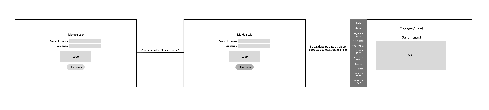
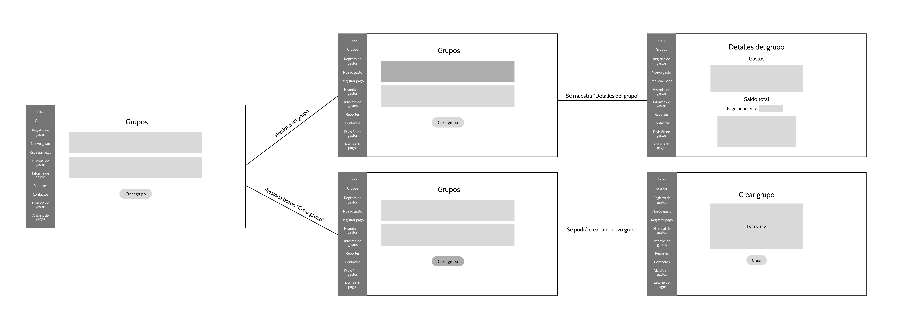
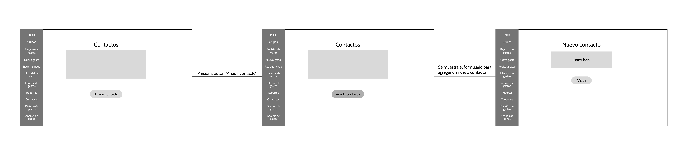
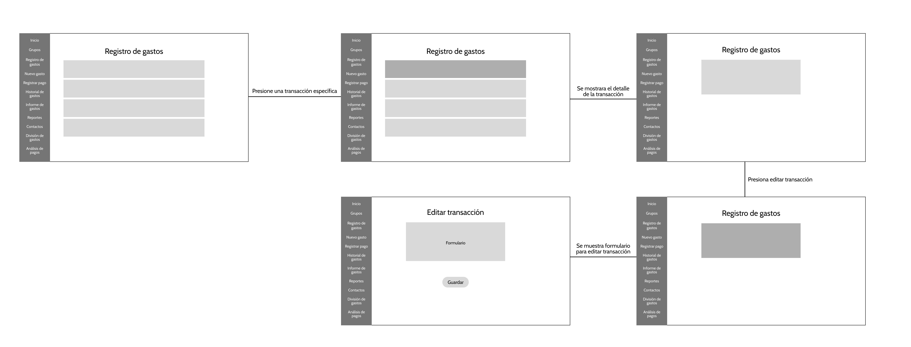

### 4.4.3. Web Applications Mock-ups
Para el mock-up de la aplicación web de FinanceGuard se utilizo un lenguaje fácil de entender. Además, el tamaño de la letra elegido permite que los usuarios puedan tener una mejor visualización de la aplicación web. Los colores de los botones permiten que el usuario pueda encontrarlos rápidamente. Por otro lado, las secciones se encuentran en la izquierda, debido a que el usuario podrá hallarlos fácilmente.
- Iniciar sesión

- Inicio

- Grupos

- Registro de gastos

- Nuevo gasto

- Registrar pago

- Historial de gastos

- Informe de gastos

- Reportes

- Contactos

- División de gastos

- Análisis de pagos

### 4.4.4. Web Applications User Flow Diagrams

#### User Flow Registro de Gastos

 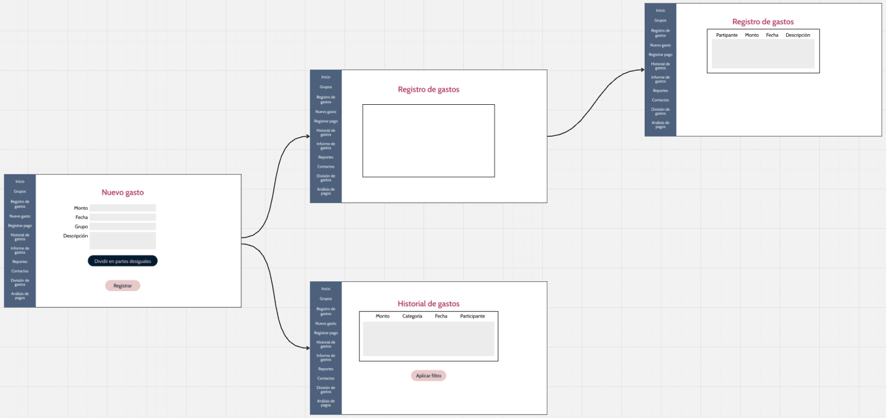 

**Descripción:** El usuario ingresa a la pantalla principal donde puede registrar un nuevo gasto llenando los detalles requeridos, como la categoría, el monto y la fecha. Tras confirmar el registro, tiene la opción de ser redirigido a una pantalla donde puede consultar el historial de todos los gastos registrados o ver específicamente los gastos recién añadidos.

#### User Flow Informes de Gastos

 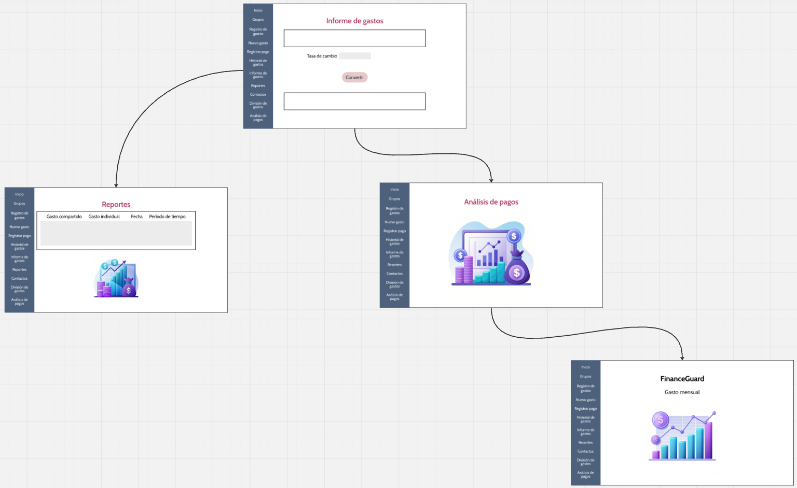 

**Descripción:** En esta secuencia, el usuario puede solicitar la generación de un informe financiero, donde define parámetros como el rango de fechas y las categorías a incluir. Una vez solicitado, el informe se genera en una nueva pantalla con todos los datos relevantes. Además, el usuario tiene la opción de ir a una pantalla de historial de informes previamente creados, donde puede ver y descargar los informes anteriores.

#### User Flow Creación de Grupos y Registro de Gasto de un Participante del Grupo

 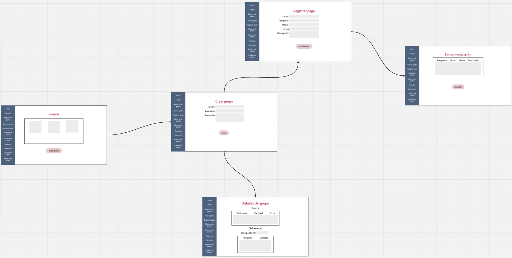 

**Descripción:** Este flujo permite al usuario crear un grupo para gestionar los gastos en equipo. El proceso comienza con la creación del grupo y la asignación de los participantes. Una vez creado, el usuario puede acceder a una pantalla de detalles del grupo para ver la información financiera del mismo. También puede ir a una pantalla donde se registre un nuevo gasto hecho por alguno de los miembros del grupo.

#### User Flow Registro de Contactos

 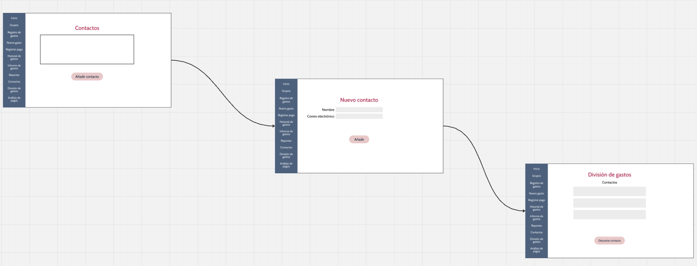 

**Descripción:** El usuario puede registrar nuevos contactos en la aplicación añadiendo los datos necesarios. Tras completar este proceso, el usuario es redirigido a una pantalla donde puede consultar y gestionar la lista de contactos previamente registrados.

## 4.5. Web Applications Prototyping
#### Desktop Web Browser

#### Mobile Web Browser

## 4.6. Domain-Driven Software Architecture
  Se desarrollará el Domain-Driven Software usando el modelo c4, se verán los 3 diagramas a continuación.
  
### 4.6.1. Software Architecture Context Diagram
  Para el diagrama de contexto de FinanceGuard se observan los dos tipos de usuarios que emplearan esta aplicación web, también podemos observar servicios externos como Email System para él envió de recordatorios.
  
  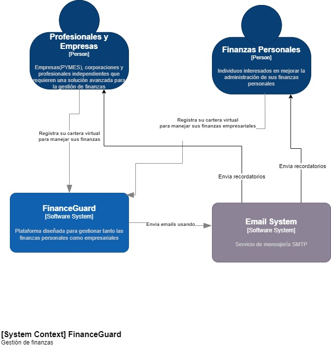
  
### 4.6.2. Software Architecture Container Diagrams
  Para el desarrollo del diagrama de contenedores de FinanceGuard se observa el landing page y a la web application con sus respectivas llamadas al API.

 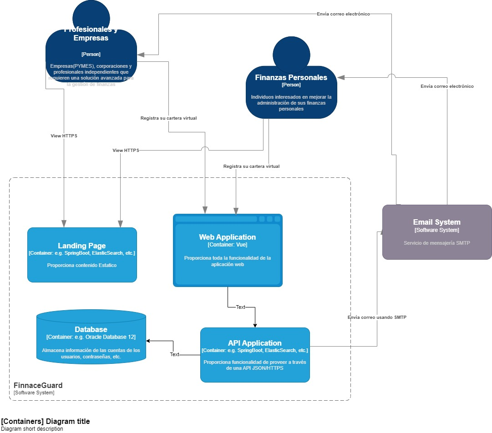
  
### 4.6.3. Software Architecture Components Diagrams
  Se observa el api application y 2 Bounded Contexts dentro de este.

 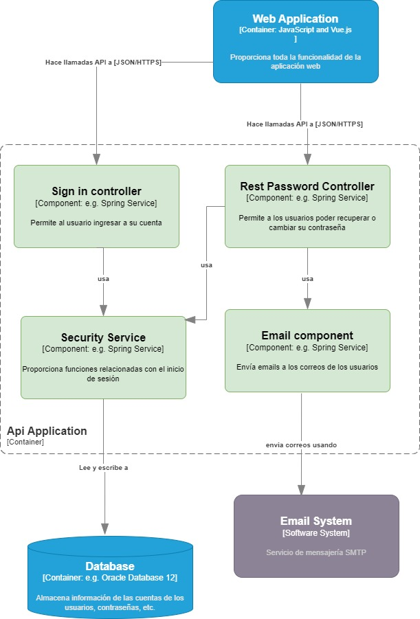

## 4.7. Software Object-Oriented Design
### 4.7.1. Class Diagrams

Diagrama de clases que representa las entidades más relevantes del sistema, detallando sus atributos, métodos y las relaciones entre ellas.

  
  
### 4.7.2. Class Dictionary

A continuación, tenemos los atributos de clase detallados:

| Entidad |Atributo |Descripción  | Tipo|
| ------------- | ------------- | ------------- | ------------- |
| User  |user_id | Identificador del usuario  | Long |
|   | name  | Nombre del usuario. | string  |
|   | email | Dirección de correo del usuario.  | string |
|   | password | Contraseña de la cuenta del usuario.  | string  |
|   | phone_number  | Número de teléfono del usuario.  | string  |
|   | subscriptions_id | Identificador de la suscripción  | long  |
| Group  | name | Nombre del grupo  | string  |
|   | members| Miembros del grupo  | string  |
|   | name | Nombre del grupo  | string  |
| Category  | name | Nombre de la categoría  | string  |
| Subscriptions  | Expiration_date | Fecha de fin de la suscripción | date  |
| Payment_card | card_number | Número de tarjeta   | string  |
|   | expiration_date | Fecha de expiración de la tarjeta  | date  |
|   | Holder_name | Nombre del propietario  | string  |
|   | Postal_code | Número postal del usuario  | string  |
| User card  | User_id | Identificador del usuario  | long  |
|   | Card_id | Identificador de la tarjeta  | long  |
| Payment| amount | Cantidad de pago | double  |
|   | User_id | Identificador del usuario  | long  |
|  GroupOperation | payment | Lista de pagos en un grupo  | list<payment> |
|   | expenses | Lista de gastos en un grupo   | list<Expenses> |
| Expenses  | amount | Costo de un gasto  | double  |
|   | User_id | identificador del usuario que realizo dicho gasto   | long |
| Groupmember  | userid | Identificador de un miembro de un grupo   | long |
|   | groupid | Identificador de un grupo   | long  |

## 4.8. Database Design
  Para el diagrama de base de datos se utilizó Vertabelo en este diagrama se pueden observar sus a detalle sus relaciones.
  
### 4.8.1. Database Diagram

# Capítulo V: Product Implementation, Validation & Deployment
## 5.1. Software Configuration Management
### 5.1.1. Software Development Environment Configuration

### 5.1.2. Source Code Management

### 5.1.3. Source Code Style Guide & Conventions

### 5.1.4. Software Deployment Configuration

## 5.2. Landing Page, Services & Applications Implementation
### 5.2.1. Sprint 1
#### 5.2.1.1. Sprint Planning 1

#### 5.2.1.2. Sprint Backlog 1

#### 5.2.1.3. Development Evidence for Sprint Review

#### 5.2.1.4. Testing Suite Evidence for Sprint Review

#### 5.2.1.5. Execution Evidence for Sprint Review

#### 5.2.1.6. Services Documentation Evidence for Sprint Review

#### 5.2.1.7. Software Deployment Evidence for Sprint Review

#### 5.2.1.8. Team Collaboration Insights during Sprint

# Conclusiones
### Conclusiones y recomendaciones
### Video About-the-Team

---
# Bibliografía

---
# Anexos
