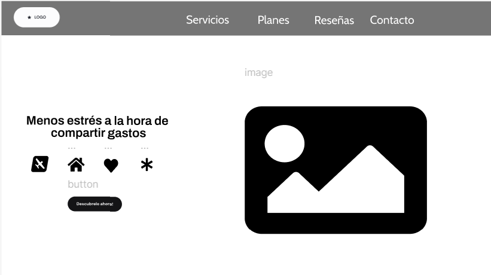
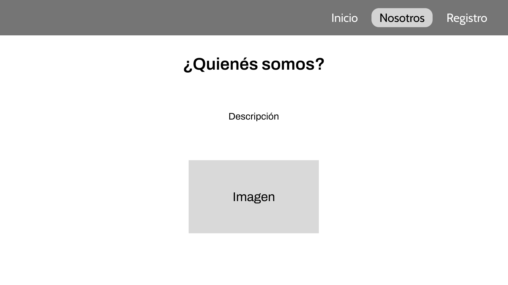

  

# Universidad Peruana de Ciencias Aplicadas

## Carrera de Ingeniería de Software

Ciclo: 2024 - 0 2

Curso: Desarrollo de Aplicaciones Web

Sección: SI92

Profesor: Naldo Reupo-Musayon Gastulo

“Informe de Trabajo Final”

Startup: 

Producto: 

|          Integrantes           |   Código   |
| :----------------------------: | :--------: |
|      Ramos Carpio, Karen       | U20201E493 |

Agosto 2024

 
 
 
 
 
 
 
 
 

# **Registro de Versiones**

<table>
  <thead>
    <tr>
        <th>Versión</th>
        <th>Fecha</th>
        <th>Autor</th>
        <th>Descripción de modificación</th>
    </tr>
  </thead>
  <tbody>
  <tr>
      <td><strong>TB1</strong></td>
      <td></td>
      <td>
        <ul>
          <li>Ramos Carpio, Karen</li>
        </ul>
      </td>
      <td>
        Se han incluído los siguientes capítulos:
        <ul>
          <li>Capítulo I: Introducción</li>
          <li>Capítulo II: Requirements Elicitation & Analysis</li>
          <li>Capítulo III: Requirements Specification</li>
          <li>Capítulo IV: Product Design</li>
          <li>Avance del Capítulo V: Product Implementation, Validation & Deployment hasta el punto 5.2.1.8</li>
          <li>Avance de Conclusiones, Bibliografía y Anexos</li>
        </ul>
      </td>
  </tr>
  </tbody>
</table>

 
 
 
 
 
 
 
 
 
 
 
 
 

# **Student Outcomes**

<table style="border-collapse: collapse; width: 100%; border: 1px solid black;">
  <thead>
    <tr style="border-bottom: 1px solid black;">
      <th style="border-right: 1px solid black;">Criterio Específico</th>
      <th style="border-right: 1px solid black;">Acciones Realizadas</th>
      <th>Conclusiones</th>
    </tr>
  </tbody>
</table>

# **Project Report Online**

URL Project Report (Github): 

### [Capítulo I: Introducción]()
- [1.1. Startup Profile]()
    - [1.1.1 Descripción de la Startup]()
    - [1.1.2 Perfiles de integrantes del equipo]()
- [1.2 Solution Profile]()
    - [1.2.1 Antecedentes y problemática]()
    - [1.2.2 Lean UX Process]()
        - [1.2.2.1. Lean UX Problem Statements]()
        - [1.2.2.2. Lean UX Assumptions]()
        - [1.2.2.3. Lean UX Hypothesis Statements]()
        - [1.2.2.4. Lean UX Canvas]()
- [1.3. Segmentos objetivo]()

### [Capítulo II: Requirements Elicitation & Analysis]()
- [2.1. Competidores]()
    - [2.1.1. Análisis competitivo]()
    - [2.1.2. Estrategias y tácticas frente a competidores]()
- [2.2. Entrevistas]()
    - [2.2.1. Diseño de entrevistas]()
    - [2.2.2. Registro de entrevistas]()
    - [2.2.3. Análisis de entrevistas]()
- [2.3. Needfinding]()
    - [2.3.1. User Personas]()
    - [2.3.2. User Task Matrix]()
    - [2.3.3. User Journey Mapping]()
    - [2.3.4. Empathy Mapping]()
    - [2.3.5. As-is Scenario Mapping]()
- [2.4. Ubiquitous Language]()

### [Capítulo III: Requirements Specification]()
- [3.1. To-Be Scenario Mapping]()
- [3.2. User Stories]()
- [3.3. Impact Mapping]()
- [3.4. Product Backlog]()

### [Capítulo IV: Product Design]()
- [4.1. Style Guidelines]()
    - [4.1.1. General Style Guidelines]()
    - [4.1.2. Web Style Guidelines]()
- [4.2. Information Architecture]()
    - [4.2.1. Organization Systems]()
    - [4.2.2. Labeling Systems]()
    - [4.2.3. SEO Tags and Meta Tags]()
    - [4.2.4. Searching Systems]()
    - [4.2.5. Navigation Systems]()
- [4.3. Landing Page UI Design]()
    - [4.3.1. Landing Page Wireframe]()
    - [4.3.2. Landing Page Mock-up]()
- [4.4. Web Applications UX/UI Design]()
    - [4.4.1. Web Applications Wireframes]()
    - [4.4.2. Web Applications Wireflow Diagrams]()
    - [4.4.3. Web Applications Mock-ups]()
    - [4.4.4. Web Applications User Flow Diagrams]()
- [4.5. Web Applications Prototyping]()
- [4.6. Domain-Driven Software Architecture]()
    - [4.6.1. Software Architecture Context Diagram]()
    - [4.6.2. Software Architecture Container Diagrams]()
    - [4.6.3. Software Architecture Components Diagrams]()
- [4.7. Software Object-Oriented Design]()
    - [4.7.1. Class Diagrams]()
    - [4.7.2. Class Dictionary]()
- [4.8. Database Design]()
    - [4.8.1. Database Diagram]()

### [Capítulo V: Product Implementation, Validation & Deployment]()
- [5.1. Software Configuration Management]()
    - [5.1.1. Software Development Environment Configuration]()
    - [5.1.2. Source Code Management]()
    - [5.1.3. Source Code Style Guide & Conventions]()
    - [5.1.4. Software Deployment Configuration]()
- [5.2. Landing Page, Services & Applications Implementation]()
    - [5.2.1. Sprint 1]()
        - [5.2.1.1. Sprint Planning 1]()
        - [5.2.1.2. Sprint Backlog 1]()
        - [5.2.1.3. Development Evidence for Sprint Review]()
        - [5.2.1.4. Testing Suite Evidence for Sprint Review]()
        - [5.2.1.5. Execution Evidence for Sprint Review]()
        - [5.2.1.6. Services Documentation Evidence for Sprint Review]()
        - [5.2.1.7. Software Deployment Evidence for Sprint Review]()
        - [5.2.1.8. Team Collaboration Insights during Sprint]()
    - [5.2.2. Sprint 2]()
        - [5.2.2.1. Sprint Planning 2]()
        - [5.2.2.2. Sprint Backlog 2]()
        - [5.2.2.3. Development Evidence for Sprint Review]()
        - [5.2.2.4. Testing Suite Evidence for Sprint Review]()
        - [5.2.2.5. Execution Evidence for Sprint Review]()
        - [5.2.2.6. Services Documentation Evidence for Sprint Review]()
        - [5.2.2.7. Software Deployment Evidence for Sprint Review]()
        - [5.2.2.8. Team Collaboration Insights during Sprint]()
    - [5.2.3. Sprint 3]()
        - [5.2.3.1. Sprint Planning 3]()
        - [5.2.3.2. Sprint Backlog 3]()
        - [5.2.3.3. Development Evidence for Sprint Review]()
        - [5.2.3.4. Testing Suite Evidence for Sprint Review]()
        - [5.2.3.5. Execution Evidence for Sprint Review]()
        - [5.2.3.6. Services Documentation Evidence for Sprint Review]()
        - [5.2.3.7. Software Deployment Evidence for Sprint Review]()
        - [5.2.3.8. Team Collaboration Insights during Sprint]()
    - [5.2.4. Sprint 4]()
        - [5.2.4.1. Sprint Planning 4]()
        - [5.2.4.2. Sprint Backlog 4]()
        - [5.2.4.3. Development Evidence for Sprint Review]()
        - [5.2.4.4. Testing Suite Evidence for Sprint Review]()
        - [5.2.4.5. Execution Evidence for Sprint Review]()
        - [5.2.4.6. Services Documentation Evidence for Sprint Review]()
        - [5.2.4.7. Software Deployment Evidence for Sprint Review]()
        - [5.2.4.8. Team Collaboration Insights during Sprint]()
- [5.3. Validation Interviews]()
    - [5.3.1. Diseño de Entrevistas]()
    - [5.3.2. Registro de Entrevistas]()
    - [5.3.3. Evaluaciones según heurísticas]()
- [5.4. Video About-the-Product]()

---
# Capítulo I: Introducción
## 1.1. Startup Profile
### 1.1.1 Descripción de la Startup
### 1.1.2 Perfiles de integrantes del equipo
## 1.2 Solution Profile
### 1.2.1 Antecedentes y problemática
### 1.2.2 Lean UX Process
#### 1.2.2.1. Lean UX Problem Statements
#### 1.2.2.2. Lean UX Assumptions
#### 1.2.2.3. Lean UX Hypothesis Statements
#### 1.2.2.4. Lean UX Canvas
## 1.3. Segmentos objetivo
# Capítulo II: Requirements Elicitation & Analysis
## 2.1 Competidores
## 2.2. Entrevistas
### 2.2.1. Diseño de entrevistas
### 2.2.2. Registro de entrevistas
### 2.2.3. Análisis de entrevistas
## 2.3. Needfinding
### 2.3.1. User Personas
### 2.3.2. User Task Matrix
### 2.3.3. User Journey Mapping
### 2.3.4. Empathy Mapping
### 2.3.5. As-is Scenario Mapping
## 2.4. Ubiquitous Language
# Capítulo III: Requirements Specification
## 3.1. To-Be Scenario Mapping
## 3.2. User Stories
## 3.3. Impact Mapping
## 3.4. Product Backlog
# Capítulo IV: Product Design
## 4.1. Style Guidelines
### 4.1.1. General Style Guidelines
#### Logo

Para el logo se optó por hacer un imagotipo, dado que proporciona un gran impacto en los usuarios. Por otro lado, el logo tiene un aspecto moderno y sutil.

#### Eslogan
**"Master your finances, secure your future"**

Es un eslogan breve y memorable. Se eligió expresar el eslogan en inglés, ya que se desea llegar a una gran cantidad de personas.

#### Tipografía
La tipografía elegida es "Cabin", debido a que tiene una apariencia moderna. Además, permite una buena legibilidad del texto.

#### Colores
Los colores elegidos son:

#041C32

#E8C8C8

#4D617D

#B1375B

Este conjunto de colores hacen una excelente combinación. Asimismo, permite que se destaque el texto, por lo tanto, el usuario podrá tener una buena lectura.

#### Lenguaje
FinanceGuard es una plataforma que incentiva el respeto. Por ello, se aplicará un lenguaje formal y respetuoso.

## 4.2. Information Architecture
En este punto se presentará la organización del landing page con la finalidad de presentar un producto de fácil comprensión para el usuario.

## 4.2.1 Organization Systems
Para la organización usamos el Thematic Organization, usando este sistema agrupamos el contenido en base a temas relevantes para los usuarios. 

## 4.2.2 Labeling Systems
Para las etiquetas usamos un lenguaje formal y fácil de entender.

| Etiqueta  | Descripción |
| ------------- | ------------- |
| Inicio | En esta sección se puede observar varios aspectos de FinanceGuard como ventajas y planes de suscripción, esta es la primera ventana que observa el usuario al ingresar a nuestra aplicación web. |
| Nosotros  | En esta sección se observan la misión y visión además de brindar información de quienes somos.  |
| Registro  | En esta sección el usuario podrá ingresar sus datos y crear una cuenta de acorde a sus necesidades. |

## 4.2.3 SEO Tags and Meta Tags

  Landing Page:
  •	Title: ¿Qué es FinanceGuard?
  •	Description: Plataforma diseñada para gestionar tanto las finanzas personales como empresariales
  •	Keywords: finanzas, ahorro, planificación
  •	Author: FinanceGuard

## 4.3. Landing Page UI Design
### 4.3.1. Landing Page Wireframes
Para los wireframes del landing page de FinanceGuard, se hizo un diseño sencillo de entender para los usuarios y con una apariencia moderna.

Por otro lado, a través de los wireframes se puede observar la estructura del landing page, el cual tendrá una cabecera con tres secciones, los cuales son inicio, nosotros y registro. Asimismo, en el contenido se mostrará ventajas y suscripciones, además de una descripción de FinanceGuard y también de TechTitans.

#### Desktop Web Browser
- Inicio

- Nosotros

#### Mobile Web Browser
- Inicio

- Nosotros

### 4.3.2. Landing Page Mock-up
Para el mock-up del landing page de FinanceGuard, se utilizo colores que combinan muy bien juntos, el cual permite que el usuario pueda tener una mejor visualización del contenido. Por otro lado, se puso información importante en el landing page para que el usuario conozca todas las carecterísticas de FinanceGuard.
#### Desktop Web Browser
- Inicio

- Nosotros

#### Mobile Web Browser
- Inicio

- Nosotros

## 4.4. Web Applications UX/UI Design
### 4.4.1. Web Applications Wireframes
Para los wireframes de la aplicación web de FinanceGuard se utilizo una estructura que será fácil de entender para el usuario. Además, cada sección de la aplicación web tiene una variedad de herramientas que ayudara mucho al usuario a poder gestionar sus finanzas.
- Iniciar sesión

- Inicio

- Grupos

- Registro de gastos

- Nuevo gasto

- Registrar pago

- Historial de gastos

- Informe de gastos

- Reportes

- Contactos

- División de gastos

- Análisis de pagos

### 4.4.2. Web Applications Wireflow Diagrams
### 4.4.3. Web Applications Mock-ups
Para el mock-up de la aplicación web de FinanceGuard se utilizo un lenguaje fácil de entender. Además, el tamaño de la letra elegido permite que los usuarios puedan tener una mejor visualización de la aplicación web. Los colores de los botones permiten que el usuario pueda encontrarlos rápidamente. Por otro lado, las secciones se encuentran en la izquierda, debido a que el usuario podrá hallarlos fácilmente.
- Iniciar sesión

- Inicio

- Grupos

- Registro de gastos

- Nuevo gasto

- Registrar pago

- Historial de gastos

- Informe de gastos

- Reportes

- Contactos

- División de gastos

- Análisis de pagos

### 4.4.4. Web Applications User Flow Diagrams
## 4.5. Web Applications Prototyping
#### Desktop Web Browser

#### Mobile Web Browser

## 4.6. Domain-Driven Software Architecture
### 4.6.1. Software Architecture Context Diagram
### 4.6.2. Software Architecture Container Diagrams
### 4.6.3. Software Architecture Components Diagrams
## 4.7. Software Object-Oriented Design
### 4.7.1. Class Diagrams
### 4.7.2. Class Dictionary
## 4.8. Database Design
### 4.8.1. Database Diagram
# Capítulo V: Product Implementation, Validation & Deployment
## 5.1. Software Configuration Management
### 5.1.1. Software Development Environment Configuration

### 5.1.2. Source Code Management

### 5.1.3. Source Code Style Guide & Conventions

### 5.1.4. Software Deployment Configuration

## 5.2. Landing Page, Services & Applications Implementation
### 5.2.1. Sprint 1
#### 5.2.1.1. Sprint Planning 1

#### 5.2.1.2. Sprint Backlog 1

#### 5.2.1.3. Development Evidence for Sprint Review

#### 5.2.1.4. Testing Suite Evidence for Sprint Review

#### 5.2.1.5. Execution Evidence for Sprint Review

#### 5.2.1.6. Services Documentation Evidence for Sprint Review

#### 5.2.1.7. Software Deployment Evidence for Sprint Review

#### 5.2.1.8. Team Collaboration Insights during Sprint

# Conclusiones
### Conclusiones y recomendaciones
### Video About-the-Team

---
# Bibliografía

---
# Anexos
