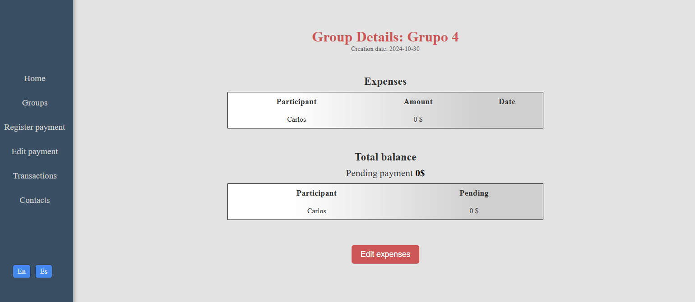
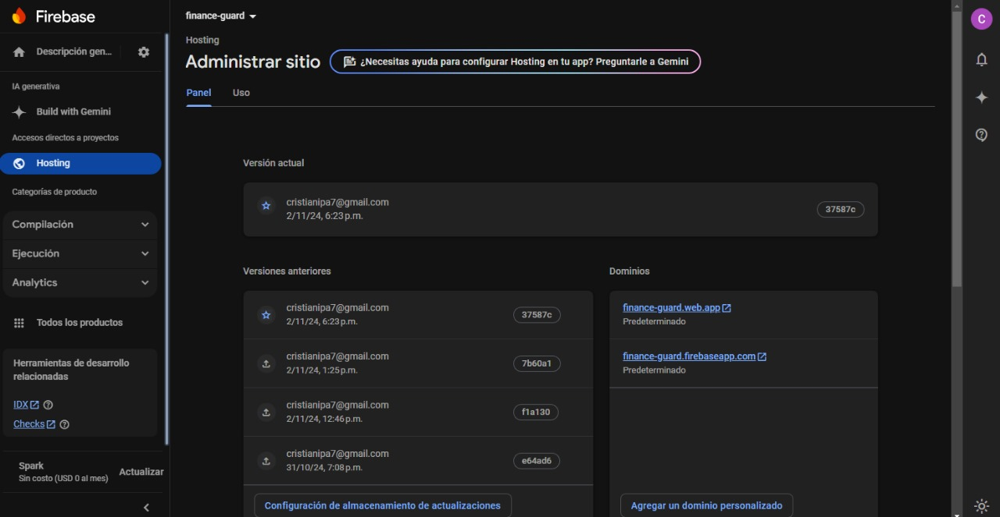
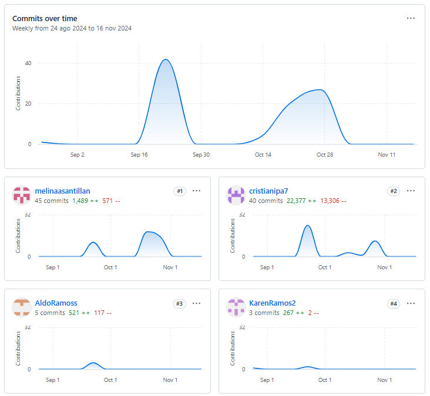

  

# Universidad Peruana de Ciencias Aplicadas

## Carrera de Ingeniería de Software

Ciclo: 2024 - 0 2

Curso: Desarrollo de Aplicaciones Web

Sección: SI92

Profesor: Naldo Reupo-Musayon Gastulo

“Informe de Trabajo Final”

Startup: TechTitans

Producto: FinanceGuard

|          Integrantes           |   Código   |
| :----------------------------: | :--------: |
|      Ramos Carpio, Karen       | U20201E493 |
|      Martinez Villanueva, Piero Alonso       | U202113821 |

Agosto 2024

 
 
 
 
 
 
 
 
 

# **Registro de Versiones**

<table>
  <thead>
    <tr>
        <th>Versión</th>
        <th>Fecha</th>
        <th>Autor</th>
        <th>Descripción de modificación</th>
    </tr>
  </thead>
  <tbody>
  <tr>
      <td><strong>TB1</strong></td>
      <td></td>
      <td>
        <ul>
          <li>Ramos Carpio, Karen</li>
        </ul>
      </td>
      <td>
        Se han incluído los siguientes capítulos:
        <ul>
          <li>Capítulo I: Introducción</li>
          <li>Capítulo II: Requirements Elicitation & Analysis</li>
          <li>Capítulo III: Requirements Specification</li>
          <li>Capítulo IV: Product Design</li>
          <li>Avance del Capítulo V: Product Implementation, Validation & Deployment hasta el punto 5.2.1.8</li>
          <li>Avance de Conclusiones, Bibliografía y Anexos</li>
        </ul>
      </td>
  </tr>
  </tbody>
</table>

 
 
 
 
 
 
 
 
 
 
 
 
 

# **Student Outcomes**

<table style="border-collapse: collapse; width: 100%; border: 1px solid black;">
  <thead>
    <tr style="border-bottom: 1px solid black;">
      <th style="border-right: 1px solid black;">Criterio Específico</th>
      <th style="border-right: 1px solid black;">Acciones Realizadas</th>
      <th>Conclusiones</th>
    </tr>
  </tbody>
</table>

# **Project Report Online**

URL Project Report (Github): 

### [Capítulo I: Introducción]()
- [1.1. Startup Profile]()
    - [1.1.1 Descripción de la Startup]()
    - [1.1.2 Perfiles de integrantes del equipo]()
- [1.2 Solution Profile]()
    - [1.2.1 Antecedentes y problemática]()
    - [1.2.2 Lean UX Process]()
        - [1.2.2.1. Lean UX Problem Statements]()
        - [1.2.2.2. Lean UX Assumptions]()
        - [1.2.2.3. Lean UX Hypothesis Statements]()
        - [1.2.2.4. Lean UX Canvas]()
- [1.3. Segmentos objetivo]()

### [Capítulo II: Requirements Elicitation & Analysis]()
- [2.1. Competidores]()
    - [2.1.1. Análisis competitivo]()
    - [2.1.2. Estrategias y tácticas frente a competidores]()
- [2.2. Entrevistas]()
    - [2.2.1. Diseño de entrevistas]()
    - [2.2.2. Registro de entrevistas]()
    - [2.2.3. Análisis de entrevistas]()
- [2.3. Needfinding]()
    - [2.3.1. User Personas]()
    - [2.3.2. User Task Matrix]()
    - [2.3.3. User Journey Mapping]()
    - [2.3.4. Empathy Mapping]()
    - [2.3.5. As-is Scenario Mapping]()
- [2.4. Ubiquitous Language]()

### [Capítulo III: Requirements Specification]()
- [3.1. To-Be Scenario Mapping]()
- [3.2. User Stories]()
- [3.3. Impact Mapping]()
- [3.4. Product Backlog]()

### [Capítulo IV: Product Design]()
- [4.1. Style Guidelines]()
    - [4.1.1. General Style Guidelines]()
    - [4.1.2. Web Style Guidelines]()
- [4.2. Information Architecture]()
    - [4.2.1. Organization Systems]()
    - [4.2.2. Labeling Systems]()
    - [4.2.3. SEO Tags and Meta Tags]()
    - [4.2.4. Searching Systems]()
    - [4.2.5. Navigation Systems]()
- [4.3. Landing Page UI Design]()
    - [4.3.1. Landing Page Wireframe]()
    - [4.3.2. Landing Page Mock-up]()
- [4.4. Web Applications UX/UI Design]()
    - [4.4.1. Web Applications Wireframes]()
    - [4.4.2. Web Applications Wireflow Diagrams]()
    - [4.4.3. Web Applications Mock-ups]()
    - [4.4.4. Web Applications User Flow Diagrams]()
- [4.5. Web Applications Prototyping]()
- [4.6. Domain-Driven Software Architecture]()
    - [4.6.1. Software Architecture Context Diagram]()
    - [4.6.2. Software Architecture Container Diagrams]()
    - [4.6.3. Software Architecture Components Diagrams]()
- [4.7. Software Object-Oriented Design]()
    - [4.7.1. Class Diagrams]()
    - [4.7.2. Class Dictionary]()
- [4.8. Database Design]()
    - [4.8.1. Database Diagram]()

### [Capítulo V: Product Implementation, Validation & Deployment]()
- [5.1. Software Configuration Management]()
    - [5.1.1. Software Development Environment Configuration]()
    - [5.1.2. Source Code Management]()
    - [5.1.3. Source Code Style Guide & Conventions]()
    - [5.1.4. Software Deployment Configuration]()
- [5.2. Landing Page, Services & Applications Implementation]()
    - [5.2.1. Sprint 1]()
        - [5.2.1.1. Sprint Planning 1]()
        - [5.2.1.2. Sprint Backlog 1]()
        - [5.2.1.3. Development Evidence for Sprint Review]()
        - [5.2.1.4. Testing Suite Evidence for Sprint Review]()
        - [5.2.1.5. Execution Evidence for Sprint Review]()
        - [5.2.1.6. Services Documentation Evidence for Sprint Review]()
        - [5.2.1.7. Software Deployment Evidence for Sprint Review]()
        - [5.2.1.8. Team Collaboration Insights during Sprint]()
    - [5.2.2. Sprint 2]()
        - [5.2.2.1. Sprint Planning 2]()
        - [5.2.2.2. Sprint Backlog 2]()
        - [5.2.2.3. Development Evidence for Sprint Review]()
        - [5.2.2.4. Testing Suite Evidence for Sprint Review]()
        - [5.2.2.5. Execution Evidence for Sprint Review]()
        - [5.2.2.6. Services Documentation Evidence for Sprint Review]()
        - [5.2.2.7. Software Deployment Evidence for Sprint Review]()
        - [5.2.2.8. Team Collaboration Insights during Sprint]()
    - [5.2.3. Sprint 3]()
        - [5.2.3.1. Sprint Planning 3]()
        - [5.2.3.2. Sprint Backlog 3]()
        - [5.2.3.3. Development Evidence for Sprint Review]()
        - [5.2.3.4. Testing Suite Evidence for Sprint Review]()
        - [5.2.3.5. Execution Evidence for Sprint Review]()
        - [5.2.3.6. Services Documentation Evidence for Sprint Review]()
        - [5.2.3.7. Software Deployment Evidence for Sprint Review]()
        - [5.2.3.8. Team Collaboration Insights during Sprint]()
    - [5.2.4. Sprint 4]()
        - [5.2.4.1. Sprint Planning 4]()
        - [5.2.4.2. Sprint Backlog 4]()
        - [5.2.4.3. Development Evidence for Sprint Review]()
        - [5.2.4.4. Testing Suite Evidence for Sprint Review]()
        - [5.2.4.5. Execution Evidence for Sprint Review]()
        - [5.2.4.6. Services Documentation Evidence for Sprint Review]()
        - [5.2.4.7. Software Deployment Evidence for Sprint Review]()
        - [5.2.4.8. Team Collaboration Insights during Sprint]()
- [5.3. Validation Interviews]()
    - [5.3.1. Diseño de Entrevistas]()
    - [5.3.2. Registro de Entrevistas]()
    - [5.3.3. Evaluaciones según heurísticas]()
- [5.4. Video About-the-Product]()

---
# Capítulo I: Introducción
## 1.1. Startup Profile

Esta sección proporciona una visión integral de la startup, incluyendo una descripción detallada de su misión, visión, y el producto que ofrece. Además, se presentan los perfiles de los miembros clave del equipo, destacando sus habilidades, experiencia y contribuciones al desarrollo y éxito de la empresa. Aquí se busca brindar una comprensión completa de la identidad y el potencial del startup, así como de las personas que impulsan su crecimiento.

### 1.1.1 Descripción de la Startup

*TechTitans* presenta *FinanceGuard*, una innovadora plataforma diseñada para gestionar tanto las finanzas personales como empresariales. Con el objetivo principal de simplificar la administración del dinero y mejorar la organización financiera de sus usuarios, FinanceGuard ofrece una experiencia intuitiva y eficiente.

La plataforma permite a los usuarios crear grupos para gestionar y compartir gastos de manera colaborativa. Dentro de estos grupos, se pueden registrar gastos, especificar quién pagó y cuánto, así como distribuir los costos entre los participantes. Además, FinanceGuard calcula automáticamente las deudas y saldos, proporcionando una visión clara de quién debe a quién, lo que resulta especialmente útil para compañeros de cuarto, parejas, amigos o familiares que comparten gastos en actividades como viajes, cenas, alquileres, facturas de servicios y compras conjuntas.

Más allá de las finanzas personales, FinanceGuard ofrece herramientas avanzadas para la gestión financiera empresarial. Entre estas, se incluyen la conciliación de cuentas y la generación de reportes contables detallados, facilitando el seguimiento y optimización de los recursos económicos de las empresas.

FinanceGuard empodera a sus usuarios, tanto individuales como corporativos, a tomar el control de su bienestar financiero, brindándoles las herramientas necesarias para seguir sus gastos, establecer metas financieras y ajustar sus presupuestos en función de sus objetivos económicos. Esta solución integral no solo mejora la transparencia financiera, sino que también promueve una mayor estabilidad económica, ayudando a los usuarios a alcanzar sus metas con confianza.

**Misión:** En FinanceGuard, nuestra misión es capacitar a individuos y empresas para que tomen las riendas de su bienestar financiero mediante una administración precisa, accesible y fácil de usar. Nos comprometemos a ofrecer soluciones innovadoras que simplifiquen el monitoreo, la planificación y la optimización de los recursos financieros, con el propósito de fomentar una mayor seguridad económica y ayudar a nuestros usuarios a cumplir sus objetivos financieros con certeza.

**Visión:** Aspiramos a convertirnos en la plataforma de referencia en la gestión financiera personal y empresarial, reconocida por nuestra capacidad de revolucionar la manera en que las personas y organizaciones administran sus finanzas. Nuestro objetivo es construir un futuro donde la claridad financiera y la educación económica estén al alcance de todos, contribuyendo al desarrollo económico y al bienestar integral de nuestros usuarios.

**Logotipo del servicio:**

### 1.1.2 Perfiles de integrantes del equipo

<TABLE BORDER>
	<TR>
		<TH><h2>Intregantes</h2></TH> 
		<TH><h2>Descripción</h2></TH>
		<TH><h2>Conocimientos</h2></TH>
	</TR>
	<TR>
		<td style="text-align: center" align="center">
 Karen Ramos Carpio - U20201E493  
</td>
		<td style="text-align: center" align="center">Cuento con gran capacidad de autoaprendizaje, esto me permite alcanzar mejores índices de productividad para la empresa de forma individual como en trabajo en equipo para poder llegar a los 		objetivos definidos por la empresa.Tengo un alto sentido del compromiso y la responsabilidad por lo que puedo garantizar que la tarea que me sea asignada será gestionada con diligencia.</td>
		<td style="text-align: center" align="center">Desarrollador entusiasta de resolución de problemas de .NET con experiencia en C#, JavaScript, TypeScript, Golang, C++, HTML CSS. Además de .NET, .Net Core, Angular, React y Kendo UI. 			Trabaja bien tanto individualmente como en un ambiente de equipo. Como profesional de TI, me dedico a administrar mis proyectos hasta su finalización, asegurándose de que se completen en el plazo establecido</td>
	</TR>
  	<TR>
		<td style="text-align: center" align="center">
 Piero Alonso Martinez Villanueva - U202113821  
</td> 
		<td style="text-align: center" align="center">Poseo experiencia en trabajo en equipo, aportando ideas innovadoras y soluciones eficaces, siendo puntual con los plazos establecidos en la elaboración de los proyectos. Me gusta aprender sobre nuevas tecnologías, además de ser paciente y perseverante en el desarrrollo de un proyecto.</td>
		<td style="text-align: center" align="center">Tengo experiencia en lenguajes de programación como C++, C#, Java, JavaScript y HTML y en programas de diseño como Illustrator, Photoshop, CorelDraw y Maya3D.</td>
	</TR>
  <TR>
		<td style="text-align: center" align="center">
 xxxxxxx - U   
</td> 
		<td style="text-align: center" align="center">xxx</td>
		<td style="text-align: center" align="center">xxx</td>
	</TR>
  <TR>
		<td style="text-align: center" align="center">
 xxxxxxx - U   
</td> 
		<td style="text-align: center" align="center">xxx</td>
		<td style="text-align: center" align="center">xxx</td>
	</TR>
  <TR>
		<td style="text-align: center" align="center">
 xxxxxxx - U   
</td> 
		<td style="text-align: center" align="center">xxx</td>
		<td style="text-align: center" align="center">xxx</td>
	</TR>
  <TR>
		<td style="text-align: center" align="center">
 xxxxxxx - U   
</td> 
		<td style="text-align: center" align="center">xxx</td>
		<td style="text-align: center" align="center">xxx</td>
	</TR>
</TABLE>

## 1.2 Solution Profile
### 1.2.1 Antecedentes y problemática
Para identificar el contexto en el que se situa FinanceGuard, utilizaremos la técnica de las 5 W's y 2 H's.

#### 1.2.1.1. Las 5 W's:

- **What (Qué):** 
FinanceGuard es una plataforma digital diseñada para simplificar la gestión de finanzas tanto personales como empresariales. Permite a los usuarios organizar y compartir gastos, gestionar deudas, y seguir objetivos financieros. Además, ofrece herramientas avanzadas para la conciliación de cuentas y la generación de reportes contables.

- **Why (Por qué):** 
Existe una necesidad creciente de herramientas que faciliten la gestión financiera, especialmente en contextos de colaboración como grupos de amigos, compañeros de cuarto, parejas, y empresas. FinanceGuard responde a esta necesidad ofreciendo una solución que promueve la transparencia, la organización y la estabilidad financiera.

- **Who (Quién):** 
El producto está dirigido a individuos que comparten gastos con otros, como amigos, compañeros de cuarto, parejas, y familiares, así como a pequeñas y medianas empresas que requieren herramientas eficientes para la gestión contable y financiera.

- **Where (Dónde):** 
FinanceGuard se implementa como una aplicación móvil y web, accesible desde cualquier lugar con conexión a internet, lo que permite a los usuarios gestionar sus finanzas en tiempo real, sin importar su ubicación.

- **When (Cuándo):** 
El uso de FinanceGuard es continuo, permitiendo a los usuarios realizar un seguimiento constante de sus finanzas, tanto en el día a día como a largo plazo, ajustándose a sus necesidades en cualquier momento.

#### 1.2.1.2. Las 2 H's:

- **How (Cómo):** 
FinanceGuard funciona mediante la creación de grupos donde los usuarios pueden agregar y gestionar gastos compartidos. La plataforma automatiza el cálculo de deudas y saldos, proporciona herramientas para establecer y seguir objetivos financieros, y ofrece funciones específicas para la gestión empresarial, como la conciliación de cuentas y la generación de reportes.

- **How much (Cuánto):** 
El modelo de negocio puede incluir diferentes niveles de suscripción, desde una versión gratuita con funciones básicas hasta planes de pago que ofrecen características avanzadas para usuarios personales y empresariales. El costo variará según el nivel de acceso y las herramientas necesarias para cada tipo de usuario.

### 1.2.2 Lean UX Process
#### 1.2.2.1. Lean UX Problem Statements
FinanceGuard es una plataforma integral diseñada para la gestión de finanzas personales y empresariales. Su objetivo es ofrecer a los usuarios una solución completa para el seguimiento de gastos, la organización de presupuestos, y la optimización de recursos económicos, tanto a nivel individual como para pequeñas y medianas empresas.

Hemos identificado que en el contexto actual, muchas personas y organizaciones enfrentan dificultades significativas debido a la falta de herramientas efectivas para la administración financiera. La dependencia de métodos manuales, como hojas de cálculo y registros dispersos, conlleva a problemas de desorganización, errores en el seguimiento de gastos, y una gestión ineficiente de los recursos económicos. Esto puede resultar en desequilibrios presupuestarios, pérdidas económicas, y dificultades para alcanzar metas financieras, afectando tanto la estabilidad financiera como la capacidad de toma de decisiones informadas.

¿Cómo podríamos abordar estos problemas mediante una herramienta que integre y automatice la gestión financiera, proporcionando una visión clara y accesible de los ingresos, gastos y deudas? La solución debería simplificar la planificación financiera, mejorar la precisión en el seguimiento de metas económicas y facilitar la toma de decisiones estratégicas, contribuyendo así a una mayor estabilidad y éxito financiero a largo plazo.

#### 1.2.2.2. Lean UX Assumptions

##### 1.2.2.2.1. Assumptions:

- Existe una demanda en el mercado para una solución digital que simplifique la gestión de finanzas personales y empresariales, ayudando a los usuarios a mantener un control más preciso sobre sus recursos económicos.
- Los individuos y las pequeñas y medianas empresas están dispuestos a adoptar una plataforma digital para la administración financiera, reconociendo sus beneficios en términos de claridad, eficiencia y toma de decisiones.
- La plataforma será técnicamente viable y escalable, capaz de manejar grandes volúmenes de datos financieros y operaciones complejas.
- Se espera que la plataforma proporcione a los usuarios una mejora significativa en la organización de sus finanzas, reduciendo el riesgo de errores y facilitando la planificación financiera.
- Se asume que una interfaz de usuario intuitiva y fácil de usar será clave para la aceptación y adopción generalizada de la plataforma.
- Se anticipa que la plataforma ofrecerá funcionalidades de integración con otras herramientas financieras y bancos para facilitar una gestión financiera más coherente y completa.

##### 1.2.2.2.2. Features:

- La plataforma permitirá el seguimiento en tiempo real de gastos e ingresos, facilitando una gestión financiera precisa y actualizada.
- Integrará funcionalidades para la creación y seguimiento de presupuestos y metas financieras, ayudando a los usuarios a planificar y ajustar sus finanzas de manera efectiva.
- Ofrecerá herramientas automáticas para el cálculo de deudas y saldos, proporcionando una visión clara de las obligaciones financieras entre los usuarios.
- Incorporará alertas automáticas y recordatorios para fechas límite de pagos y vencimientos de presupuestos, ayudando a evitar retrasos y cargos adicionales.
- Dispone de una interfaz intuitiva y fácil de usar que permite a los usuarios gestionar sus finanzas de manera sencilla y accesible.
- Ofrecerá capacidades de generación de reportes financieros detallados y personalizados, facilitando la toma de decisiones y la planificación estratégica.

#### 1.2.2.3. Lean UX Hypothesis Statements
- **1st Hypothesis Statement:**  
Nosotros creemos que si implementamos una función de categorización automática de gastos en FinanceGuard,
Cuando los usuarios registren nuevas transacciones en la plataforma,
Veremos que la clasificación y organización de los gastos mejorará, y los usuarios podrán generar reportes financieros más precisos y detallados sin esfuerzo adicional,
Mediremos esto a través de la comparación del tiempo invertido en categorizar gastos manualmente antes y después de la implementación, así como la retroalimentación de los usuarios sobre la precisión y utilidad de la categorización automática.

- **2nd Hypothesis Statement:**  
Nosotros creemos que si desarrollamos una función de alertas personalizadas para vencimientos de pagos y metas financieras en FinanceGuard,
Cuando los usuarios configuren sus alertas y realicen un seguimiento de sus pagos y objetivos en la plataforma,
Veremos que la puntualidad en los pagos y el cumplimiento de metas financieras mejorará, reduciendo la cantidad de cargos por pagos atrasados y ayudando a los usuarios a alcanzar sus metas con mayor eficacia,
Mediremos esto a través de la comparación de la cantidad de cargos por pagos atrasados y la tasa de cumplimiento de metas antes y después de la implementación de las alertas personalizadas, así como la retroalimentación de los usuarios sobre la efectividad y utilidad de las alertas.

- **3rd Hypothesis Statement:**  
Nosotros creemos que si integramos una herramienta de análisis de tendencias financieras en FinanceGuard que utilice datos históricos para predecir patrones de gastos e ingresos,
Cuando los usuarios consulten estos análisis para planificar su presupuesto y ajustar sus gastos,
Veremos que la precisión en la planificación financiera y la toma de decisiones mejorará, permitiendo a los usuarios evitar desajustes presupuestarios y optimizar su administración económica,
Mediremos esto a través de la comparación de la precisión en la planificación financiera antes y después de la integración del análisis de tendencias, así como la evaluación del impacto en la satisfacción del usuario y la eficiencia en la gestión del presupuesto a través de encuestas y métricas de uso.

#### 1.2.2.4. Lean UX Canvas

| **Business Problema**   Desarrollar una plataforma digital que permita a los usuarios gestionar de manera eficaz tanto sus finanzas personales como empresariales. La solución debe facilitar la organización de gastos compartidos, la optimización del flujo de efectivo y la planificación financiera. El desafío radica en la ausencia de herramientas integradas y fáciles de usar que permitan a las personas y a las empresas controlar sus gastos y establecer metas financieras de manera eficiente. Los métodos actuales suelen ser ineficaces y propensos a errores, lo que afecta la capacidad de tomar decisiones financieras informadas y precisas. | **Solution Ideas**   1. Crear una plataforma digital que facilite la gestión de finanzas personales y empresariales mediante la integración de herramientas de seguimiento y análisis de gastos.  2. Implementar funcionalidades para la creación de grupos de gasto, permitiendo a los usuarios dividir y gestionar gastos compartidos de manera clara y eficiente.  3. Desarrollar herramientas de planificación financiera que permitan a los usuarios establecer y seguir metas económicas, ajustando sus presupuestos según sus objetivos.  4. Ofrecer integración con cuentas bancarias y otras herramientas digitales para una experiencia fluida y centralizada en la gestión financiera.  5. Incluir características para el análisis y reporte de gastos, proporcionando a los usuarios información detallada y útil para la toma de decisiones financieras. | **Business Outcomes**   La implementación de FinanceGuard busca ofrecer una solución integral que mejore la eficiencia en la gestión financiera tanto para individuos como para empresas. Se espera que la plataforma facilite una organización más efectiva de los gastos, reduzca los errores asociados con métodos manuales y mejore la toma de decisiones financieras. Los resultados deseados incluyen una mayor claridad en el manejo del dinero, la optimización del flujo de efectivo y la capacidad de alcanzar metas financieras con mayor confianza. A largo plazo, se busca posicionar a FinanceGuard como una herramienta líder en la gestión financiera, apreciada por su facilidad de uso y su impacto positivo en la estabilidad económica de sus usuarios. |
| ---    | ----     | ---      | 
| 
 **Users & Customers**    Los usuarios y clientes de FinanceGuard incluyen:   1. **Profesionales y Empresas:** Estos usuarios buscan una solución robusta para gestionar finanzas empresariales, controlar gastos y optimizar el flujo de efectivo. Necesitan herramientas que faciliten la conciliación de cuentas, la generación de reportes contables y el seguimiento detallado de las finanzas empresariales.    2. **Usuarios de Finanzas Personales** Este segmento está compuesto por individuos interesados en mejorar su control presupuestario, seguir sus gastos y planificar financieramente para el futuro. Valoran soluciones digitales que les ayuden a mantener una visión clara y organizada de sus finanzas personales. 
 |  | 
 **User Benefits**    Los beneficios para los usuarios de FinanceGuard incluyen:   1. Mejora en la organización y seguimiento de gastos tanto personales como empresariales.  2. Capacidad para dividir y gestionar gastos compartidos de manera eficiente.  3. Herramientas de planificación financiera que facilitan la definición y el seguimiento de metas económicas.  4. Integración con cuentas bancarias y herramientas digitales para una gestión financiera centralizada y fluida.  5. Reportes detallados y análisis que permiten una mejor toma de decisiones financieras.
   6. Optimización del flujo de efectivo y reducción de errores asociados con métodos manuales. | 
| 
 **Hypothesis Statement**   Nosotros creemos que al implementar FinanceGuard como una solución integral para la gestión financiera:  **Hipótesis 1:** Creemos que al simplificar el proceso de registro y seguimiento de gastos en FinanceGuard, los usuarios mejorarán su capacidad para organizar y controlar sus finanzas. Esto se medirá mediante la comparación de la eficiencia en la gestión de gastos antes y después de la implementación, y la retroalimentación de los usuarios sobre la facilidad de uso.  **Hipótesis 2:** Si incorporamos herramientas de planificación financiera que permitan a los usuarios establecer y seguir metas económicas, mejoraremos la capacidad de los usuarios para alcanzar sus objetivos financieros. La validación se hará a través de la evaluación del progreso hacia las metas antes y después de la implementación, y recopilando la retroalimentación sobre la utilidad de estas herramientas.  **Hipótesis 3:** Al integrar FinanceGuard con cuentas bancarias y otras herramientas digitales, se facilitará una gestión financiera más centralizada y precisa. Esto se evaluará comparando la efectividad en la gestión financiera antes y después de la integración, y mediante encuestas para evaluar la satisfacción del usuario con la integración de estas herramientas.  
| 
 **What's the most important thing we need to learn first?**    Lo más importante que necesitamos aprender primero es comprender las necesidades específicas de los usuarios tanto individuales como empresariales en la gestión de sus finanzas. Esto nos permitirá diseñar funcionalidades que realmente aborden sus problemas y optimicen su experiencia en la gestión financiera. 
| 
 **What's the least amount of work we need to do learn the next most important thing?**    Para aprender lo siguiente más importante, necesitamos realizar entrevistas breves con usuarios potenciales para identificar sus desafíos y necesidades en la gestión de finanzas. Adicionalmente, revisaremos estudios de mercado y tendencias en herramientas de gestión financiera para obtener información relevante y actualizada que guíe el desarrollo de FinanceGuard.
 |

## 1.3. Segmentos objetivo

FinanceGuard se dirige a dos audiencias meta clave: *Profesionales y Empresas* y *Usuarios de Finanzas Personales*. La plataforma está diseñada para ofrecer soluciones financieras adaptadas a las necesidades específicas de cada grupo, asegurando una gestión efectiva y personalizada de sus recursos económicos.

**Profesionales y Empresas:** Este grupo incluye pequeñas y medianas empresas (PYMES), grandes corporaciones y profesionales independientes que requieren una solución avanzada para la gestión de finanzas empresariales. Buscan optimizar el control de gastos, mejorar la gestión del flujo de efectivo y obtener informes financieros detallados que faciliten la toma de decisiones estratégicas.

**Usuarios de Finanzas Personales:** Este segmento está compuesto por individuos interesados en mejorar la administración de sus finanzas personales. Buscan una plataforma que les permita controlar sus presupuestos, seguir sus gastos y planificar sus objetivos financieros con precisión, facilitando una visión clara y organizada de su situación económica.

# Capítulo II: Requirements Elicitation & Analysis
## 2.1 Competidores
## 2.2. Entrevistas
### 2.2.1. Diseño de entrevistas
### 2.2.2. Registro de entrevistas
### 2.2.3. Análisis de entrevistas
## 2.3. Needfinding
### 2.3.1. User Personas
### 2.3.2. User Task Matrix
### 2.3.3. User Journey Mapping
### 2.3.4. Empathy Mapping
### 2.3.5. As-is Scenario Mapping
## 2.4. Ubiquitous Language
# Capítulo III: Requirements Specification
## 3.1. To-Be Scenario Mapping
## 3.2. User Stories
## 3.3. Impact Mapping
## 3.4. Product Backlog
# Capítulo IV: Product Design
## 4.1. Style Guidelines
## 4.2. Information Architecture
## 4.3. Landing Page UI Design
## 4.4. Web Applications UX/UI Design
### 4.4.1. Web Applications Wireframes
### 4.4.2. Web Applications Wireflow Diagrams
### 4.4.3. Web Applications Mock-ups
### 4.4.4. Web Applications User Flow Diagrams
## 4.5. Web Applications Prototyping
## 4.6. Domain-Driven Software Architecture
### 4.6.1. Software Architecture Context Diagram
### 4.6.2. Software Architecture Container Diagrams
### 4.6.3. Software Architecture Components Diagrams
## 4.7. Software Object-Oriented Design
### 4.7.1. Class Diagrams
### 4.7.2. Class Dictionary
## 4.8. Database Design
### 4.8.1. Database Diagram
# Capítulo V: Product Implementation, Validation & Deployment
## 5.1. Software Configuration Management
### 5.1.1. Software Development Environment Configuration

**Requirements Management**

1. Trello: Es una herramienta utilizada para gestionar el flujo de trabajo de proyectos principalmente basados en marcos detrabajos ágiles. Será empleado para visualizar y actualizar el estado actual de las tareas e historias de usuariopertenecientes al sprint a desarrollar. Ruta de referencia https://trello.com/es
2. Vertabelo: Herramienta técnica para diseñar y modelar bases de datos. Ruta de referencia https://vertabelo.com

**Product UX/UI Design**

1. Figma: Plataforma de elaboración de prototipos y edición gráfica, principalmente utilizado para el diseño digital. En elcaso del proyecto, será utilizado para el prototipado de la aplicación y sus versiones de Desktop y Mobile Web Browser.Ruta de referencia https://www.figma.com/login2.
2. SmartUML: Aplicación para diagramar flujos. Será empleado para el diseño de wireflows, user-flows y el diagrama declases asociado a la aplicación. Ruta de referencia https://www.lucidchart.com/

**Software Development**

1. WebStorm: Entorno de desarrollo integrado elegido para la elaboración y compilación del código por motivos dedominio por parte de los integrantes del equipo de trabajo. Utilizar este IDE supone de valor para el desarrollo del proyecto puesto que incluye la posibilidad de agregar extensiones de utilidad, soporte de edición de texto en múltipleslenguajes de programación, disponibilidade en múltiples sistemas operativos, entre otros beneficios. Ruta de referencia https://www.jetbrains.com/webstorm/
2. HTML5: HyperText Markup Language, o por sus siglas HTML, es un lenguaje de etiquetado para páginas web. Seráempleado en el desarrollo del proyecto para la presentación del contenido en la aplicación. Ruta de referenciahttps://www.w3schools.com/html/html5_syntax.asp
3. CSS: Cascading Style Sheets es un lenguaje que maneja el diseño y presentación de las páginas web, el cual va de la manocon HTML. Ruta de referencia https://google.github.io/styleguide/htmlcssguide.html
4. JavaScript: Es un lenguaje de programación interpretado y orientado a objetos. Se utilizará para elaborar la interfaz deusuario dentro de la aplicación. Ruta de referencia https://developer.mozilla.org/es/docs/Web/JavaScript
5. Angular: Angular es un framework de desarrollo de aplicaciones web de código abierto y basado en TypeScript, mantenido por Google y una comunidad de desarrolladores. Es utilizado para crear aplicaciones web de una sola página (SPA) y aplicaciones web dinámicas. Angular proporciona un conjunto de herramientas y bibliotecas que simplifican el desarrollo de aplicaciones web complejas al seguir el patrón de arquitectura Modelo-Vista-Controlador (MVC) y ofrecer funcionalidades como enlace de datos bidireccional, inyección de dependencias, rutas, formularios reactivos, animaciones y mucho más https://angular.io/

**Software Deployment**

1. Git: Herramienta de control de versiones que permite registrar y gestionar las diferentes versiones del programa. Seutilizará para mantener un historial de cambios y simplificar la corrección de errores. Los miembros del equipo accederána través de la línea de comandos en sus sistemas locales. Ruta de referencia https://git-scm.com/

**Software Documentation and Project Management**

1. Github: Plataforma basada en la nube que alojará los repositorios de código del proyecto. Facilitará la colaboración entiempo real y la revisión de contribuciones de cada miembro del equipo. Los miembros del equipo accederán a través desus navegadores web. Ruta de referencia https://github.com/

### 5.1.2. Source Code Management

Para organizar nuestro proyecto y sus modificaciones, hemos seguido lo propuesto por Vincent Dreissen: un modelo de Git de branching permite gestionar ramas de un proyecto, asi como facilitar el flujo de trabajo. Partimos con una main branch o rama master, y junto a ella, una develop branch. A partir de la rama master, surgen las Hotfix branches, que nos permiten solucionar problemas criticos directamente de la rama master. También creamos Feature branches para los cambios que hicimos a lo largo del proyecto. Estos, mediante un merge, se unen a la develop Branch. Y la develop branch al Main.

**Liks del repositorio de GitHub**:

- Link de la organización: https://github.com/UPC-PRE-SI730-2402-SI92-TechTitans
- Link de la landing page: https://github.com/UPC-PRE-SI730-2402-SI92-TechTitans/Landingpage
- Link del informe: https://github.com/UPC-PRE-SI730-2402-SI92-TechTitans/Report
- Link del front end: https://github.com/UPC-PRE-SI730-2402-SI92-TechTitans/Frontend
- Link del back end: https://github.com/UPC-PRE-SI730-2402-SI92-TechTitans/Backend

Estrucutra de las ramas:

- **Main Branch:** Esta rama es la principal de la aplicación. Donde se encontrarán las versiones más estables del desarrollo. Solo se admiten cambios que hayan sido probados en otras ramas.
- **Develop Branch:** Esta rama es donde se realizarán los avances del proyecto y desarollo.
- **Feature Branch:** Esta rama es donde se implementarán nuevas características de la aplicación, para luego ser enviada a la rama de desarrollo.
- **Release Branch:** Esta rama es una instancia de la rama Develop, para posteriormente ser enviada a la rama Main.
- **Hotfix Branch:** Estas ramas son creadas con la finalidad de corregir errores puntuales que puedan estar perjudicando al usuario en su experiencia de uso de la aplicación.

### 5.1.3. Source Code Style Guide & Conventions

**HTML**: Unas de las prácticas que hemos seguido para alcanzar un código limpio, conciso, coherente, legible y escalable son las siguientes:

- Se usan elementos HTML que tengan un significado claro y preciso para el contenido que se está marcando. Por ejemplo, utiliza header, nav, main, article, section, aside, footer, entre otros, para estructurar la landing page de forma semántica.
- Aunque HTML5 permite algunas etiquetas sin cierre (como "img" y "input"), utilizamos la buena práctica de cerrar todas las etiquetas correctamente para evitar problemas de renderizado. Por ejemplo: `
 Código claro y legible.
`
- Para mejorar la accesibilidad, siempre incluye el atributo alt en las etiquetas "img" para describir brevemente el contenido de la imagen. Por ejemplo: ``
- HTML permite combinar mayúsculas y minúsculas en los nombres de los elementos y atributos, pero limitamos dar
  al uso de solo minúsculas para preservar el orden y asegurar la legibilidad del código.
- No omitir las etiquetas `<html>`, `<body>` y `<header>`.
- Escribir en una línea los comentarios cortos.

**CSS**: Entre las prácticas se mencionan:

- Los nombres de clases son intuitivos, legibles y autodescriptivos.
- Separar los nombres de las clases y ID con guión, por ejemplo: `#userViajero-id` y`.userImg-shape{}`
- Separar las declaraciones y selectores en nuevas líneas para agilizar la legibilidad.
- Usar comentarios para explicar el código.
- Aplicar sangría a todo el contenido de un bloque.

**JavaScript**: Principales prácticas aplicadas:

- Uso de camelCase para nombrar variables y funciones. Por ejemplo, `myVariable` y `myFunction`.
- Uso de PascalCase para nombrar clases y constructores.Por ejemplo, `myClass`.
- Evitar el uso de nombres de variables genéricos o ambiguos.
- Uso general de comentarios para explicar el propósito y funcionalidad de la porción del código.
- Uso de punto y coma al final de cada declaración.
- Uso de comillas simples ('') o comillas dobles ("") de forma consistente para las cadenas de texto.
- Organización del código en bloques lógicos separados por líneas en blanco para mejorar la legibilidad.
- Uso de el operador ternario `(condición ? resultadoTrue : resultadoFalse)` de manera adecuada y legible.
- Evitar el uso de funciones obsoletas o en desuso.
- Uso de try-catch para manejar y gestionar errores de manera adecuada.

### 5.1.4. Software Deployment Configuration

Para desplegar la landing page es necesario contar con una serie de requisitos, entre ellos, es necesario contar con una cuenta personal, una organización y un repositorio al cual cargar los documentos. A partir de lo anterior, es posible comenzar el despliegue de la landing page. A continuación se enuncian los pasos a seguir:
Crear una carpeta llamada "docs" para alojar el Landing Page. Asegurarse de que los archivos sigan las nomenclaturas "index.html", "style.css", "funcionalities.js" y una carpeta llamada "img" que contenga las imágenes. Cargar los archivos al repositorio mediante un commit. Dirigirse a Settings > Pages y seleccionar el branch correspondiente, en nuestro caso es el "main". Especificar la carpeta "docs" como la fuente de la página. Esperar a que GitHub realice las comprobaciones necesarias. Una vez culminado el proceso, se obtendrá un enlace que llevará al Landing Page desplegado

## 5.2. Landing Page, Services & Applications Implementation
### 5.2.1. Sprint 1
#### 5.2.1.1. Sprint Planning 1
<table style="border-collapse: collapse; width: 100%;">
<tbody>
<tr><td style="border:1pt solid #000000;padding:5pt;vertical-align:top;"><strong>Sprint #</strong></td><td style="border:1pt solid #000000;padding:5pt;vertical-align:top;"><strong>Sprint 1</strong></td></tr>
<tr><td style="border:1pt solid #000000;padding:5pt;vertical-align:top;" colspan="2"><strong>Sprint Planning Background</strong></td></tr>
<tr><td style="border:1pt solid #000000;padding:5pt;vertical-align:top;">Date</td><td style="border:1pt solid #000000;padding:5pt;vertical-align:top;">2024-09-05</td></tr>
<tr><td style="border:1pt solid #000000;padding:5pt;vertical-align:top;">Time</td><td style="border:1pt solid #000000;padding:5pt;vertical-align:top;">10:00 AM</td></tr>
<tr><td style="border:1pt solid #000000;padding:5pt;vertical-align:top;">Location</td><td style="border:1pt solid #000000;padding:5pt;vertical-align:top;">Google Meet</td></tr>
<tr><td style="border:1pt solid #000000;padding:5pt;vertical-align:top;">Prepared By</td><td style="border:1pt solid #000000;padding:5pt;vertical-align:top;">Cristian Iparraguirre</td></tr>
<tr><td style="border:1pt solid #000000;padding:5pt;vertical-align:top;">Attendees</td><td style="border:1pt solid #000000;padding:5pt;vertical-align:top;">Cristian Iparraguirre, Melina Santillan, Karen Ramos</td></tr>
<tr><td style="border:1pt solid #000000;padding:5pt;vertical-align:top;" colspan="2"><strong>Sprint Goal &amp; User Stories</strong></td></tr>
<tr><td style="border:1pt solid #000000;padding:5pt;vertical-align:top;">Sprint 1 Goal</td><td style="border:1pt solid #000000;padding:5pt;vertical-align:top;">Crear la estructura básica de la plataforma, incluyendo la página de inicio y el sistema de registro de usuarios.</td></tr>
<tr><td style="border:1pt solid #000000;padding:5pt;vertical-align:top;">Sprint 1 Velocity</td><td style="border:1pt solid #000000;padding:5pt;vertical-align:top;"><strong>20</strong></td></tr>
<tr><td style="border:1pt solid #000000;padding:5pt;vertical-align:top;">Sum of Story Points</td><td style="border:1pt solid #000000;padding:5pt;vertical-align:top;"><strong>18</strong></td></tr>
</tbody>
</table>

### 5.2.1.2. Sprint Backlog 1
<table style="border-collapse: collapse; width: 100%;">
<tbody>
<tr><td style="border:1pt solid #000000;padding:5pt;vertical-align:top;" colspan="8"><strong>SPRINT 1</strong></td></tr>
<tr><td style="border:1pt solid #000000;padding:5pt;vertical-align:top;" colspan="2"><strong>User Story</strong></td><td style="border:1pt solid #000000;padding:5pt;vertical-align:top;" colspan="6"><strong>Work/Tasks</strong></td></tr>
<tr><td style="border:1pt solid #000000;padding:5pt;vertical-align:top;"><strong>ID</strong></td><td style="border:1pt solid #000000;padding:5pt;vertical-align:top;"><strong>Title</strong></td><td style="border:1pt solid #000000;padding:5pt;vertical-align:top;"><strong>ID</strong></td><td style="border:1pt solid #000000;padding:5pt;vertical-align:top;"><strong>Title</strong></td><td style="border:1pt solid #000000;padding:5pt;vertical-align:top;"><strong>Description</strong></td><td style="border:1pt solid #000000;padding:5pt;vertical-align:top;"><strong>Estimation (Hours)</strong></td><td style="border:1pt solid #000000;padding:5pt;vertical-align:top;"><strong>Assigned to</strong></td><td style="border:1pt solid #000000;padding:5pt;vertical-align:top;"><strong>Status</strong></td></tr>

<tr><td style="border:1pt solid #000000;padding:5pt;vertical-align:top;">US-01</td><td style="border:1pt solid #000000;padding:5pt;vertical-align:top;">Landing Page - Home</td><td style="border:1pt solid #000000;padding:5pt;vertical-align:top;">T1</td><td style="border:1pt solid #000000;padding:5pt;vertical-align:top;">Diseño de Landing Page</td><td style="border:1pt solid #000000;padding:5pt;vertical-align:top;">Crear una página de inicio atractiva y bien diseñada.</td><td style="border:1pt solid #000000;padding:5pt;vertical-align:top;">3h</td><td style="border:1pt solid #000000;padding:5pt;vertical-align:top;">Cristian Iparraguirre</td><td style="border:1pt solid #000000;padding:5pt;vertical-align:top;">Done</td></tr>

<tr><td style="border:1pt solid #000000;padding:5pt;vertical-align:top;">US-05</td><td style="border:1pt solid #000000;padding:5pt;vertical-align:top;">Sección Registro</td><td style="border:1pt solid #000000;padding:5pt;vertical-align:top;">T2</td><td style="border:1pt solid #000000;padding:5pt;vertical-align:top;">Implementación de formulario de registro</td><td style="border:1pt solid #000000;padding:5pt;vertical-align:top;">Desarrollar la sección de registro con formulario y apoyo visual.</td><td style="border:1pt solid #000000;padding:5pt;vertical-align:top;">4h</td><td style="border:1pt solid #000000;padding:5pt;vertical-align:top;">Melina Santillan</td><td style="border:1pt solid #000000;padding:5pt;vertical-align:top;">In Progress</td></tr>

<tr><td style="border:1pt solid #000000;padding:5pt;vertical-align:top;">US-07</td><td style="border:1pt solid #000000;padding:5pt;vertical-align:top;">Nuevo Grupo</td><td style="border:1pt solid #000000;padding:5pt;vertical-align:top;">T3</td><td style="border:1pt solid #000000;padding:5pt;vertical-align:top;">Creación de funcionalidad para nuevo grupo</td><td style="border:1pt solid #000000;padding:5pt;vertical-align:top;">Permitir al usuario crear un nuevo grupo para administrar finanzas compartidas.</td><td style="border:1pt solid #000000;padding:5pt;vertical-align:top;">3h</td><td style="border:1pt solid #000000;padding:5pt;vertical-align:top;">Karen Ramos</td><td style="border:1pt solid #000000;padding:5pt;vertical-align:top;">To Do</td></tr>

<tr><td style="border:1pt solid #000000;padding:5pt;vertical-align:top;">US-11</td><td style="border:1pt solid #000000;padding:5pt;vertical-align:top;">Reportes de Gastos</td><td style="border:1pt solid #000000;padding:5pt;vertical-align:top;">T4</td><td style="border:1pt solid #000000;padding:5pt;vertical-align:top;">Generación de reportes de gastos</td><td style="border:1pt solid #000000;padding:5pt;vertical-align:top;">Implementar una sección para visualizar reportes detallados de gastos.</td><td style="border:1pt solid #000000;padding:5pt;vertical-align:top;">5h</td><td style="border:1pt solid #000000;padding:5pt;vertical-align:top;">Cristian Iparraguirre</td><td style="border:1pt solid #000000;padding:5pt;vertical-align:top;">In Progress</td></tr>

</tbody>
</table>

#### 5.2.1.3. Development Evidence for Sprint Review
| Repository | Branch | Commit ID | Commit Message | Commit Message Body | Commited On (Date) |
|------------|--------|-----------|----------------|---------------------|--------------------|
| FinanceGuard-LandingPage | main | a1b2c3d | feat: implement initial landing page structure | Landing Page Structure Creation | 2024-07-30 |
| FinanceGuard-Frontend | feature/contacts | f435dce | feat(contacts): update package.json | Update contact package.json | 2024-08-17 |
| FinanceGuard-Frontend | feature/groups | c691604 | feat(router): adding a router and endpoints | Update contact package.json | 2024-08-25 |

#### 5.2.1.4. Testing Suite Evidence for Sprint Review
##### Unit Tests
* **Clases probadas:**
  - LandingPage: Valida la carga de componentes principales.

##### Integration Tests
* Se validó la comunicación entre el landing page y el frontend.

#### 5.2.1.5. Execution Evidence for Sprint Review
1. Sección Inicial: Se presenta nuestro proyecto.

2. Presentamos al equipo como startup

3. Sección donde exponemos nuestra misión y visión 

4. Sección de los productos ofrecidos

#### 5.2.1.6. Services Documentation Evidence for Sprint Review
Para la elaboración de este sprint no fueron contemplados el desarrollo de un Web Service así como los Services Documentation Evidence.

#### 5.2.1.7. Software Deployment Evidence for Sprint Review

#### 5.2.1.8. Team Collaboration Insights during Sprint

### 5.2.2. Sprint 2
#### 5.2.2.1. Sprint Planning 2
<table style="border-collapse: collapse; width: 100%;">
<tbody>
<tr><td style="border:1pt solid #000000;padding:5pt;vertical-align:top;"><strong>Sprint #</strong></td><td style="border:1pt solid #000000;padding:5pt;vertical-align:top;"><strong>Sprint 2</strong></td></tr>
<tr><td style="border:1pt solid #000000;padding:5pt;vertical-align:top;" colspan="2"><strong>Sprint Planning Background</strong></td></tr>
<tr><td style="border:1pt solid #000000;padding:5pt;vertical-align:top;">Date</td><td style="border:1pt solid #000000;padding:5pt;vertical-align:top;">2024-08-01</td></tr>
<tr><td style="border:1pt solid #000000;padding:5pt;vertical-align:top;">Time</td><td style="border:1pt solid #000000;padding:5pt;vertical-align:top;">10:00 AM</td></tr>
<tr><td style="border:1pt solid #000000;padding:5pt;vertical-align:top;">Location</td><td style="border:1pt solid #000000;padding:5pt;vertical-align:top;">Google Meet</td></tr>
<tr><td style="border:1pt solid #000000;padding:5pt;vertical-align:top;">Prepared By</td><td style="border:1pt solid #000000;padding:5pt;vertical-align:top;">Cristian Iparraguirre</td></tr>
<tr><td style="border:1pt solid #000000;padding:5pt;vertical-align:top;">Attendees</td><td style="border:1pt solid #000000;padding:5pt;vertical-align:top;">Cristian Iparraguirre, Melina Santillan, Karen Ramos</td></tr>
<tr><td style="border:1pt solid #000000;padding:5pt;vertical-align:top;" colspan="2"><strong>Sprint Goal &amp; User Stories</strong></td></tr>
<tr><td style="border:1pt solid #000000;padding:5pt;vertical-align:top;">Sprint 2 Goal</td><td style="border:1pt solid #000000;padding:5pt;vertical-align:top;">Desarrollar y mejorar las funcionalidades de gestión de grupos y contactos, incluyendo nuevas opciones de visualización y registro de pagos.</td></tr>
<tr><td style="border:1pt solid #000000;padding:5pt;vertical-align:top;">Sprint 2 Velocity</td><td style="border:1pt solid #000000;padding:5pt;vertical-align:top;"><strong>22</strong></td></tr>
<tr><td style="border:1pt solid #000000;padding:5pt;vertical-align:top;">Sum of Story Points</td><td style="border:1pt solid #000000;padding:5pt;vertical-align:top;"><strong>21</strong></td></tr>
</tbody>
</table>

#### 5.2.2.2. Sprint Backlog 2
<table style="border-collapse: collapse; width: 100%;">
<tbody>
<tr><td style="border:1pt solid #000000;padding:5pt;vertical-align:top;" colspan="8"><strong>SPRINT 2</strong></td></tr>
<tr><td style="border:1pt solid #000000;padding:5pt;vertical-align:top;" colspan="2"><strong>User Story</strong></td><td style="border:1pt solid #000000;padding:5pt;vertical-align:top;" colspan="6"><strong>Work/Tasks</strong></td></tr>
<tr><td style="border:1pt solid #000000;padding:5pt;vertical-align:top;"><strong>ID</strong></td><td style="border:1pt solid #000000;padding:5pt;vertical-align:top;"><strong>Title</strong></td><td style="border:1pt solid #000000;padding:5pt;vertical-align:top;"><strong>ID</strong></td><td style="border:1pt solid #000000;padding:5pt;vertical-align:top;"><strong>Title</strong></td><td style="border:1pt solid #000000;padding:5pt;vertical-align:top;"><strong>Description</strong></td><td style="border:1pt solid #000000;padding:5pt;vertical-align:top;"><strong>Estimation (Hours)</strong></td><td style="border:1pt solid #000000;padding:5pt;vertical-align:top;"><strong>Assigned to</strong></td><td style="border:1pt solid #000000;padding:5pt;vertical-align:top;"><strong>Status</strong></td></tr>

<tr><td style="border:1pt solid #000000;padding:5pt;vertical-align:top;">US-08</td><td style="border:1pt solid #000000;padding:5pt;vertical-align:top;">Lista de los grupos</td><td style="border:1pt solid #000000;padding:5pt;vertical-align:top;">T1</td><td style="border:1pt solid #000000;padding:5pt;vertical-align:top;">Creación de la vista de lista de grupos</td><td style="border:1pt solid #000000;padding:5pt;vertical-align:top;">Desarrollar la funcionalidad de búsqueda de grupos por nombre.</td><td style="border:1pt solid #000000;padding:5pt;vertical-align:top;">3h</td><td style="border:1pt solid #000000;padding:5pt;vertical-align:top;">Cristian Iparraguirre</td><td style="border:1pt solid #000000;padding:5pt;vertical-align:top;">Done</td></tr>

<tr><td style="border:1pt solid #000000;padding:5pt;vertical-align:top;">US-13</td><td style="border:1pt solid #000000;padding:5pt;vertical-align:top;">Detalles de Transacción</td><td style="border:1pt solid #000000;padding:5pt;vertical-align:top;">T2</td><td style="border:1pt solid #000000;padding:5pt;vertical-align:top;">Implementación de detalles de transacción</td><td style="border:1pt solid #000000;padding:5pt;vertical-align:top;">Desarrollar una vista detallada de cada transacción con información relevante.</td><td style="border:1pt solid #000000;padding:5pt;vertical-align:top;">4h</td><td style="border:1pt solid #000000;padding:5pt;vertical-align:top;">Melina Santillan</td><td style="border:1pt solid #000000;padding:5pt;vertical-align:top;">In Progress</td></tr>

<tr><td style="border:1pt solid #000000;padding:5pt;vertical-align:top;">US-14</td><td style="border:1pt solid #000000;padding:5pt;vertical-align:top;">Registro de Pago</td><td style="border:1pt solid #000000;padding:5pt;vertical-align:top;">T3</td><td style="border:1pt solid #000000;padding:5pt;vertical-align:top;">Desarrollo de registro de pagos</td><td style="border:1pt solid #000000;padding:5pt;vertical-align:top;">Implementar la funcionalidad de registro de pagos dentro del grupo.</td><td style="border:1pt solid #000000;padding:5pt;vertical-align:top;">5h</td><td style="border:1pt solid #000000;padding:5pt;vertical-align:top;">Karen Ramos</td><td style="border:1pt solid #000000;padding:5pt;vertical-align:top;">To Do</td></tr>

<tr><td style="border:1pt solid #000000;padding:5pt;vertical-align:top;">US-20</td><td style="border:1pt solid #000000;padding:5pt;vertical-align:top;">Grafico de avance de pagos</td><td style="border:1pt solid #000000;padding:5pt;vertical-align:top;">T4</td><td style="border:1pt solid #000000;padding:5pt;vertical-align:top;">Creación de gráfico de pagos</td><td style="border:1pt solid #000000;padding:5pt;vertical-align:top;">Generar un gráfico para visualizar el progreso de los pagos realizados.</td><td style="border:1pt solid #000000;padding:5pt;vertical-align:top;">4h</td><td style="border:1pt solid #000000;padding:5pt;vertical-align:top;">Cristian Iparraguirre</td><td style="border:1pt solid #000000;padding:5pt;vertical-align:top;">In Progress</td></tr>

</tbody>
</table>

#### 5.2.2.3. Development Evidence for Sprint Review
| Repository                 | Branch               | Commit ID | Commit Message                                | Commit Message Body                        | Commited On (Date) |
|----------------------------|----------------------|-----------|-----------------------------------------------|--------------------------------------------|---------------------|
| FinanceGuard-Frontend        | feature/groups   | a2b3c4d   | feat(groups): create group list view          | Implemented group search functionality     | 2024-08-03         |
| FinanceGuard-Frontend  | feature/transaction  | d4e5f6g   | feat(transactions): add transaction details   | Developed detailed transaction view        | 2024-08-05         |
| FinanceGuard-Frontend      | feature/payments     | g7h8i9j   | feat(payments): implement payment logging     | Added functionality to log payments        | 2024-08-08         |
| FinanceGuard-Frontend     | feature/functions     | j0k1l2m   | feat(charts): add payment progress chart      | Created visual chart for payment progress  | 2024-08-10         |
| FinanceGuard-Frontend            | feature/functions                 | k3l4m5n   | refactor(UI): improve UI for group and payment sections | Enhanced UI for clarity in transaction views | 2024-08-12         |

#### 5.2.2.4. Testing Suite Evidence for Sprint Review
En este sprint se realizaron pruebas Unitarias (Unit Tests) para las funcionalidades. Además, se realizaron pruebas de integración (Integration Tests) para la sincronización entre el frontend y el backend del sistema de búsqueda.
##### Unit Tests
* **Clases probadas:**
  - Frontend: Valida la carga de componentes principales.

##### Integration Tests
* Se validó la comunicación entre el frontend y el fakeAPI en el flujo de inicio de sesión.

#### 5.2.2.5. Execution Evidence for Sprint Review
1. Seccion de vista previa de los grupos cargados

2. Vista de los contactos del usuario

3. Gastos y pagos pendientes del grupo 

#### 5.2.2.6. Services Documentation Evidence for Sprint Review
Para la elaboración de este sprint no fueron contemplados el desarrollo de un Web Service así como los Services Documentation Evidence.

#### 5.2.2.7. Software Deployment Evidence for Sprint Review

#### 5.2.2.8. Team Collaboration Insights during Sprint

### 5.2.3. Sprint 3
#### 5.2.3.1. Sprint Planning 3
<table style="border-collapse: collapse; width: 100%;">
<tbody>
<tr><td style="border:1pt solid #000000;padding:5pt;vertical-align:top;"><strong>Sprint #</strong></td><td style="border:1pt solid #000000;padding:5pt;vertical-align:top;"><strong>Sprint 3</strong></td></tr>
<tr><td style="border:1pt solid #000000;padding:5pt;vertical-align:top;" colspan="2"><strong>Sprint Planning Background</strong></td></tr>
<tr><td style="border:1pt solid #000000;padding:5pt;vertical-align:top;">Date</td><td style="border:1pt solid #000000;padding:5pt;vertical-align:top;">2024-09-15</td></tr>
<tr><td style="border:1pt solid #000000;padding:5pt;vertical-align:top;">Time</td><td style="border:1pt solid #000000;padding:5pt;vertical-align:top;">10:00 AM</td></tr>
<tr><td style="border:1pt solid #000000;padding:5pt;vertical-align:top;">Location</td><td style="border:1pt solid #000000;padding:5pt;vertical-align:top;">Google Meet</td></tr>
<tr><td style="border:1pt solid #000000;padding:5pt;vertical-align:top;">Prepared By</td><td style="border:1pt solid #000000;padding:5pt;vertical-align:top;">Cristian Iparraguirre</td></tr>
<tr><td style="border:1pt solid #000000;padding:5pt;vertical-align:top;">Attendees</td><td style="border:1pt solid #000000;padding:5pt;vertical-align:top;">Cristian Iparraguirre, Melina Santillan, Karen Ramos</td></tr>
<tr><td style="border:1pt solid #000000;padding:5pt;vertical-align:top;" colspan="2"><strong>Sprint Goal &amp; User Stories</strong></td></tr>
<tr><td style="border:1pt solid #000000;padding:5pt;vertical-align:top;">Sprint 3 Goal</td><td style="border:1pt solid #000000;padding:5pt;vertical-align:top;">Desarrollar las funcionalidades avanzadas de análisis financiero y manejo de los grupos y contactos.</td></tr>
<tr><td style="border:1pt solid #000000;padding:5pt;vertical-align:top;">Sprint 3 Velocity</td><td style="border:1pt solid #000000;padding:5pt;vertical-align:top;"><strong>25</strong></td></tr>
<tr><td style="border:1pt solid #000000;padding:5pt;vertical-align:top;">Sum of Story Points</td><td style="border:1pt solid #000000;padding:5pt;vertical-align:top;"><strong>24</strong></td></tr>
</tbody>
</table>

#### 5.2.3.2. Sprint Backlog 3
<table style="border-collapse: collapse; width: 100%;">
<tbody>
<tr><td style="border:1pt solid #000000;padding:5pt;vertical-align:top;" colspan="8"><strong>SPRINT 3</strong></td></tr>
<tr><td style="border:1pt solid #000000;padding:5pt;vertical-align:top;" colspan="2"><strong>User Story</strong></td><td style="border:1pt solid #000000;padding:5pt;vertical-align:top;" colspan="6"><strong>Work/Tasks</strong></td></tr>
<tr><td style="border:1pt solid #000000;padding:5pt;vertical-align:top;"><strong>ID</strong></td><td style="border:1pt solid #000000;padding:5pt;vertical-align:top;"><strong>Title</strong></td><td style="border:1pt solid #000000;padding:5pt;vertical-align:top;"><strong>ID</strong></td><td style="border:1pt solid #000000;padding:5pt;vertical-align:top;"><strong>Title</strong></td><td style="border:1pt solid #000000;padding:5pt;vertical-align:top;"><strong>Description</strong></td><td style="border:1pt solid #000000;padding:5pt;vertical-align:top;"><strong>Estimation (Hours)</strong></td><td style="border:1pt solid #000000;padding:5pt;vertical-align:top;"><strong>Assigned to</strong></td><td style="border:1pt solid #000000;padding:5pt;vertical-align:top;"><strong>Status</strong></td></tr>

<tr><td style="border:1pt solid #000000;padding:5pt;vertical-align:top;">US-11</td><td style="border:1pt solid #000000;padding:5pt;vertical-align:top;">Reportes de Gastos</td><td style="border:1pt solid #000000;padding:5pt;vertical-align:top;">T1</td><td style="border:1pt solid #000000;padding:5pt;vertical-align:top;">Generación de reportes de gastos detallados</td><td style="border:1pt solid #000000;padding:5pt;vertical-align:top;">Implementar vista para mostrar análisis de gastos mensuales.</td><td style="border:1pt solid #000000;padding:5pt;vertical-align:top;">4h</td><td style="border:1pt solid #000000;padding:5pt;vertical-align:top;">Cristian Iparraguirre</td><td style="border:1pt solid #000000;padding:5pt;vertical-align:top;">Done</td></tr>

<tr><td style="border:1pt solid #000000;padding:5pt;vertical-align:top;">US-16</td><td style="border:1pt solid #000000;padding:5pt;vertical-align:top;">Dividir Gastos</td><td style="border:1pt solid #000000;padding:5pt;vertical-align:top;">T2</td><td style="border:1pt solid #000000;padding:5pt;vertical-align:top;">Funcionalidad de división de gastos</td><td style="border:1pt solid #000000;padding:5pt;vertical-align:top;">Permitir que los usuarios dividan los gastos entre miembros de grupo.</td><td style="border:1pt solid #000000;padding:5pt;vertical-align:top;">5h</td><td style="border:1pt solid #000000;padding:5pt;vertical-align:top;">Melina Santillan</td><td style="border:1pt solid #000000;padding:5pt;vertical-align:top;">In Progress</td></tr>

<tr><td style="border:1pt solid #000000;padding:5pt;vertical-align:top;">US-17</td><td style="border:1pt solid #000000;padding:5pt;vertical-align:top;">Gráfico de Gastos Mensuales</td><td style="border:1pt solid #000000;padding:5pt;vertical-align:top;">T3</td><td style="border:1pt solid #000000;padding:5pt;vertical-align:top;">Implementación de gráfico mensual de gastos</td><td style="border:1pt solid #000000;padding:5pt;vertical-align:top;">Crear una visualización gráfica de los gastos mensuales de los usuarios.</td><td style="border:1pt solid #000000;padding:5pt;vertical-align:top;">4h</td><td style="border:1pt solid #000000;padding:5pt;vertical-align:top;">Karen Ramos</td><td style="border:1pt solid #000000;padding:5pt;vertical-align:top;">To Do</td></tr>

<tr><td style="border:1pt solid #000000;padding:5pt;vertical-align:top;">US-19</td><td style="border:1pt solid #000000;padding:5pt;vertical-align:top;">Descartar Contactos</td><td style="border:1pt solid #000000;padding:5pt;vertical-align:top;">T4</td><td style="border:1pt solid #000000;padding:5pt;vertical-align:top;">Funcionalidad para descartar contactos</td><td style="border:1pt solid #000000;padding:5pt;vertical-align:top;">Permitir la gestión y eliminación de contactos del grupo.</td><td style="border:1pt solid #000000;padding:5pt;vertical-align:top;">3h</td><td style="border:1pt solid #000000;padding:5pt;vertical-align:top;">Cristian Iparraguirre</td><td style="border:1pt solid #000000;padding:5pt;vertical-align:top;">In Progress</td></tr>

</tbody>
</table>

#### 5.2.3.3. Development Evidence for Sprint Review
| Repository                 | Branch                    | Commit ID | Commit Message                              | Commit Message Body                            | Commited On (Date) |
|----------------------------|---------------------------|-----------|---------------------------------------------|------------------------------------------------|---------------------|
| FinanceGuard-Frontend       | feature/functions   | b2c3d4e   | feat(reports): create detailed expense report view | Created report view for monthly expense analysis | 2024-09-26         |
| FinanceGuard-Frontend  | feature/functions     | d3e4f5g   | feat(split): add expense split feature      | Implemented feature to split expenses among users | 2024-09-10         |
| FinanceGuard-Frontend        | feature/groups    | e4f5g6h   | feat(charts): add monthly expenses chart    | Developed graphical representation of monthly expenses | 2024-10-13         |
| FinanceGuard-Frontend      | feature/contacts   | f5g6h7i   | feat(contacts): add contact removal option  | Enabled removal of contacts from group management | 2024-10-15         |
| FinanceGuard-Frontend | feature/groups     | g6h7i8j   | feat(groups): integrate evidence of expenses and pending payment | Added expenses reports | 2024-09-22         |

#### 5.2.3.4. Testing Suite Evidence for Sprint Review
En este sprint se realizaron pruebas Unitarias (Unit Tests) para las funcionalidades. Además, se realizaron pruebas de integración (Integration Tests) para la sincronización entre el frontend y el fakeAPI del sistema de búsqueda.
##### Unit Tests
* **Clases probadas:**
  - ReportsView: Validar que la vista de reportes muestra los datos correctos de gastos mensuales.
  - ExpenseSplit: Comprobar que los gastos se dividan correctamente entre los miembros del grupo.

##### Integration Tests
* Integración del gráfico de gastos mensuales**: Se realizaron pruebas de integración para asegurar que el gráfico de gastos mensuales muestre datos precisos y esté sincronizado con la base de datos.

##### Repositorio y Commits relacionados con Testing:
| Repository                 | Branch               | Commit ID | Commit Message                          | Commit Message Body                                   | Commited On (Date) |
|----------------------------|----------------------|-----------|-----------------------------------------|-------------------------------------------------------|---------------------|
| FinanceGuard-Frontend       | feature/tests        | h7i8j9k   | test: add unit tests for ReportsView    | Unit tests for ReportsView and expense data validation | 2024-08-18         |
| FinanceGuard-Frontend  | feature/tests        | i8j9k0l   | test: add tests for ExpenseSplit        | Unit tests for expense division functionality         | 2024-08-19         |
| FinanceGuard-Frontend        | feature/tests        | j9k0l1m   | test: add integration tests for Charts  | Integration tests for monthly expenses chart          | 2024-08-20         |

#### 5.2.3.5. Execution Evidence for Sprint Review
1. Vista del informe creada para el análisis de gastos mensuales.

1. Vista de la eliminación de contactos en la gestión de grupos.

1. Vista de la modificación de la cantidad y pago pendiente de cada participante en el grupo.

#### 5.2.3.6. Services Documentation Evidence for Sprint Review
Para la elaboración de este sprint no fueron contemplados el desarrollo de un Web Service así como los Services Documentation Evidence.

#### 5.2.3.7. Software Deployment Evidence for Sprint Review

#### 5.2.3.8. Team Collaboration Insights during Sprint

# Conclusiones
### Conclusiones y recomendaciones
### Video About-the-Team

---
# Bibliografía

---
# Anexos
